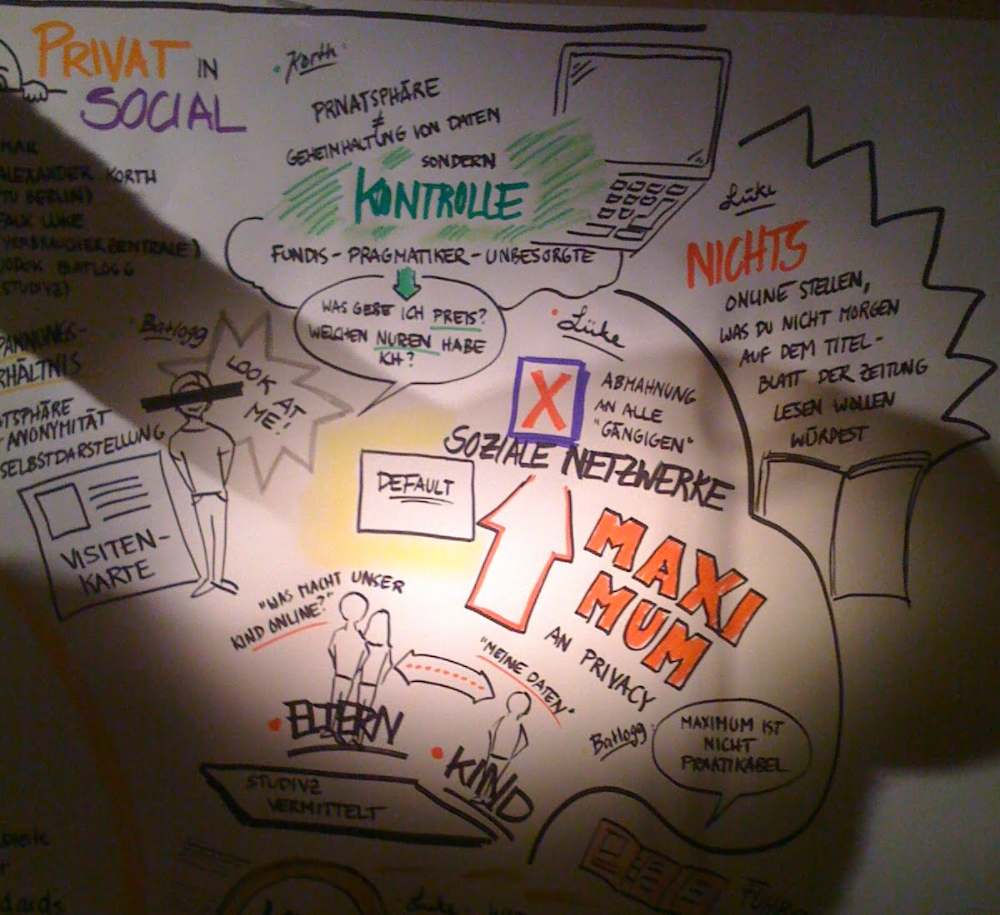

…are hard.
But if you don’t begin, you’ll never end up somewhere. This the first post on my shiny new blog. huzzah!

I’ll write down what moves me, what I’m thinking about, what I want to share, what I want to remember and what I want to say.

## Privacy

This is also an important step on my move to more privacy, less tracking and towards independence of the dominating privacy-killers Google, Facebook or how you name them. I’m convinced that – apart from climate related issues – privacy is one of the most important topics in the upcoming decade.

Exactly 10 years ago I was living in Berlin and working as CTO of VZ Netzwerke. We were running Europe’s most trafficked websites – the Social Networks StudiVZ, MeinVZ and SchülerVZ with 16M active users.
At this time Facebook started to grow really fast and overtake VZnet which had no chance to compete. Facebook had way more engineering resources, but a main reason for growing faster their disrespect of german/european privacy laws.

We did our best to be fully compliant with the privacy laws and spent a lot to educate society about it. It did not help. **People didn’t seem to care** about it. Not at all.

10 years later we’re at a point where I can feel a change in trend. More and more people are aware that the (mainly) US tech giants like Google and Facebook are building millions and millions of user profiles and abuse them.
I’ve made the decision to avoid feeding them and will carefully think about the online services I use.

Here’s a selection of what I’ve done so far:

- Switch to **Firefox** as default browser on all devices. Turn enhanced privacy protection / strict mode on. I strongly suggest you [download it](https://www.mozilla.org/en-US/firefox/download/thanks/) and do the first step to protect your privacy now.
- Using [DuckDuckGo](https://duckduckgo.com) as default search engine. It has vastly improved over the last years – and I only rarely need to add !g to my query to fall back to Google search.
- I’m logged out of Facebook and leave it dormant right now.

I’ll keep using Twitter (even use it more) and also keep somewhat trust that Apple will keep the personal data I store with them safe and private.

Let’s see how it goes with comments – Right now I’m using Nick Grossmans [Discuss on Twitter](https://www.nickgrossman.is/2020/the-discuss-on-twitter-wordpress-plugin/) plugin. You can also subscribe via E-Mail on the [About](https://batlogg.com/about/) page.
