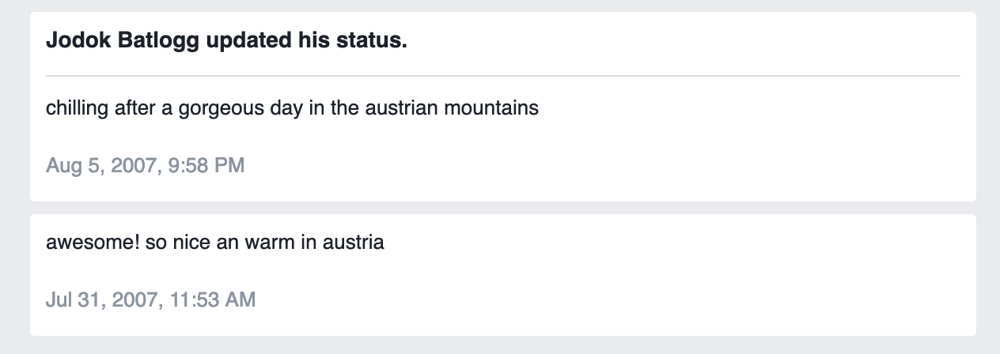

I was thinking about quitting Facebook already for a long time. But I didn’t have the guts to do so. But now I finally quit ~~smoking~~ Facebook.

I did it

Today I saw the [Twitter thread (german)](https://twitter.com/fpoefails/status/1218114675717656576) about our wonderful Minister of Justice Alma Zadić where Facebook provided the platform to threat her, harass her. It was the last straw that broke the camels back.   
I spare you the details, but Business insider compiled a list of some other [not so nice things](https://www.businessinsider.com/biggest-facebook-scandals-list-mark-zuckerberg-leaked-harvard-messages-2019-7?r=DE&IR=T#september-2018-instagram-cofounders-quit-facebook-10).

I was friends with Facebook for 12.5 years. It was an easy way to connect with everybody (I could even poke people). By reading my timeline once a day I was able to stay up to date and receive all relevant (?) information.

My first two status updates

## Digital Minimalism

Following the concept of “[Digital Minimalism](https://www.calnewport.com/books/digital-minimalism/)” by Cal Newport I’m striving to live my digital life according to my values. I only use things that provide a clear value add to me.

It’s also about how much time you spend. 60min of Facebook a day don’t provide 60x the value add of 1min.

Cal Newport recommends to do a “[Digital Declutter](https://www.cnbc.com/2019/04/09/cal-newport-a-digital-declutter-can-help-you-reduce-smartphone-time.html)“. A 30 day period where you avoid all digital activities that are not absolutely necessary.   
In this period you start doing more and more other things that you like. That will be hard – because eating cake with your aunt doesn’t provide the same kick as a shot of heroin.  
After that you carefully think about what digital tools you’re adding back to your life. What is the right ratio of effort and benefit.

In the case of Facebook it took me more that 30 days.   
First I move the App from the Homescreen of my phone to the second page (I think already 2 years ago).  
Then I removed the app and used only the browser version.   
A couple of month i logged out on all devices (and only logged in a few times).

Now I’m going to delete my account. No I’m not going to suspend it first. Maybe I’ll miss messenger?

Bye bye!
