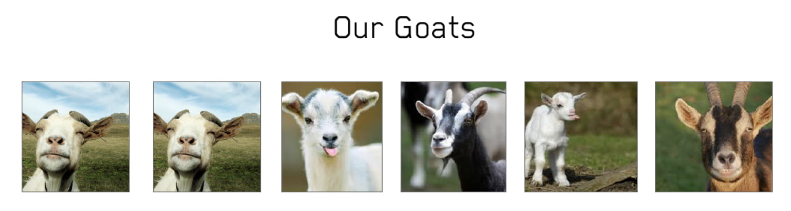
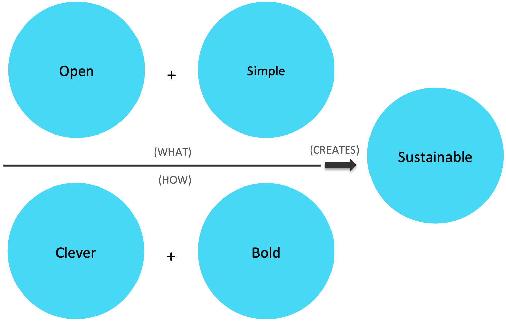

Hi, welcome to the team. I’m so glad you are here at [Crate](https://crate.io). You’re now a Cratie!

You’ll need at least one cycle to figure this place out. Maybe even two cycles. That’s totally o.k. – take your time. Uh? a cycle? What’s that? Let’s call it 1-2 quarters (of a year) for now.
When entering a new environment, the first impression is really important. And we’re working hard to make the first experience a good one. But as we’re a bunch of curious, different and complex people solving complex problems this will take some time. Btw. complex is still better than complicated[^1].

Be curious, meet everyone, look around, ask all the questions, write and talk to whomever you want. I bet there are many new acronyms, habits and rituals to learn. This will time until you’re fully productive. We expect that. In case you feel unsafe or don’t dare to ask someone, you have multiple fallbacks: your onboarding buddy, your lead person or just me.

Company culture is reflecting the people working there. What you do is who you are[^2]. It started based on the belief of the two founders – Christian and me. Over the last 6 years we kept a lot of principles, but also carefully changed others.
The following paragraphs are a user guide to navigate Crate and navigate it. It captures what you can expect out of working as part of the team, our aspirations and the leadership values that influence our culture.

My intent is to accelerate the working relationship between all of us with this document.

## Our Average Week

People work from where they want and when they want. It might seem this is less efficient than having all people at one place for fixed hours. But we’ve deliberatly decided to craft a remote-friendly culture that even allows people in different timezones to be included. It makes us resilient and adaptable. It is sustainable. We’ll do as many things asynchronously and in written format as possible. People working in one of the offices have the advantage of meet at the espresso machine – and have random chats. But even if you are remote or in a different office you will be able to see and talk with your team mates at least once per day: During the daily coffee – a video call that the team does once a day. This call is about social interaction, staying connected and getting better known to each other. The teams decide themselves how to organize the rest of the work and agile methodology. One nice weekly ritual worth mentioning for the people sharing a location is the weekly team lunch – we cook something together in Dornbirn and invite you to go for lunch in other locations.

It’s up to you and your lead to agree on a schedule to set expectations, about cadence and structure/tools of 1:1s and related topics.

We have a bi-weekly all-hands meeting (attendance optional) where the leadership will present a summary about what’s going on in the different areas of the business and is also open to questions. The meeting is also recorded in case you can’t attend.

You can contact the founders 24hours a day. Don’t worry. We’re used to that and have tuned the notifications of our phones and other tools in a way that is in harmony with our private life. If we don’t want to be disturbed we’ll manage to not be disturbed.

If one of us is traveling, out of office, ill or on vacation, we update our status beforehand in Pingboard[^3]. All our meetings still occur albeit with time zone considerations.

Some of us work now and then on weekends, evenings or early mornings. Some start later, some leave earlier. This is their choice. **We do not expect that you are going to work on the weekend, evenings or early mornings.** We might be sending mails and Slack messages, but unless the thing says URGENT, it can always wait until work begins for you on Monday.
It’s up to you to find your work/life balance, be an integrated part of a team that delivers results. We’ll help you to do so.

We all take vacations. You should, too. Disconnected from work is when we do some of the best work.

## North Star Principles

**Simply Sustainable** takes a major concern and common claim – simplicity – and qualifies with the ultimate payoff: sustainability, an application and a business that can scale and maintain itself ad infinitum.
It’s forward looking – in a world of data overload, this is how we do more than survive: it’s how we thrive.
Sustainability demands balance, playing well with others, moving forward with peace of mind. And who doesn’t want it to be simple??

> Crate is a team of passionate, experienced people who’ve crafted a **bold** and **clever** database for the fast, data-intensive world, making speed, scalability super **simple**, **open**, and accessible – a solution that’s built to be **sustainable** for all.

*Crate.io Brand Story*

**Clever.** We’re passionate people with a love of technology and a lot of experience. But technologic breakthroughs don’t just come from knowing your stuff. They come from looking at things from different angles and flipping the situation around: they come from being clever.

**Bold.** We believe in being bold, in the power of having a vision and the gumption to realize it, however radical. Being bold means seeing the big picture and believing you can impact it, shape it, make it better.

**Open.** The best solutions come from people listening to each other as they share information, insight, and experience. Which is why we are fanatically open and honest — listening to our customers, being good citizens of the open source community, building with others to make solutions better.

**Simple.** It takes a deep understanding of the craft, coupled with human empathy, to render the complex simple. To make it accessible for all. In everything we do, from how we configure data and integration with existing systems to user dashboards, documentation, and support, we aim to keep it all super simple. Because data should work for everyone.

**Sustainable.** We believe the best solutions are sustainable, supporting communities and businesses as they grow. Which is why we believe in working together, building on each other’s advances, all in order to create open and accessible solutions that are sustainable for all.

*Crate.io Brand Pillars*

## Our System Of Values

Our [Values](/assets/200119-System-of-Values.pdf) are the guiding principles that lead to what we do on a daily basis. They are the parameters that tune our decision process that results in **how we behave if no one watches**. This is what we call culture.
You can rely on those values, and you can demand them at any time.

**Meaningfulness**. At any time we offer to explain the meaningfulness and relationale of tasks, goals and measures.

**Success.** We strive towards and celebrate joint success.

**Colleguality.** We offer a work environment based on collaboration and cooperation. At the same time we respect everyone’s individuality.

**Esteem.** We appreciate and respect each and everyone and their opinions and provide open and honest feedback.

**Challenge.** It is our aspiration to provide everyone with the opportunity to grow by taking on new and challenging tasks.

**Self-determination.** There is as much room for self-determination as possible.

**Joy.** By Living Our Values above we gain happiness and satisfaction.

## Expectations and Feedback Protocol

We firmly believe that the process of setting, expressing and matching expectations is at the core of building trust and respect in a team. This requires the continuous process of giving and receiving feedback.

At Crate.io, there is a formal feedback cycle which occurs twice a year. We have outlined the structure of an appraisal interview in a separate [document](/assets/200119-Appraisal-Interviews.pdf).

## Meeting Protocol

Meetings take time, we take care about our mutual time. Therfor we have a couple of principles for our meetings. First of all we deliberately run our calendars publicly visible. If you have a question about any meeting on any calendar, just ask. If a meeting is private or confidential, you’ll most likely just see a placeholder. The vast majority of meetings are neither private nor confidential.

Each meeting has to include an agenda and/or intended purpose, the appropriate amount of productive attendees, and the expected contribution of the parties invited. If Craties are attending a meeting, they prefer starting on time. If Craties are running a meeting, they will start that meeting on time. If it’s not clear to a Cratie why they are in a meeting, they will ask for clarification on their attendance.

If you send a presentation deck a reasonable amount of time before a meeting, we will read it before the meeting and will have our questions ready. If we haven’t read the deck, we will tell you.

If a meeting completes its intended purpose before it’s scheduled to end, let’s give the time back to everyone. If it’s clear the intended goal won’t be achieved in the allotted time, let’s stop the meeting before time is up and determine how to finish the meeting later.

## Nuances (and Errata)

**Being a diverse team** is a priceless advantage. Because tolerance creates creativity. And creativity is the most precious ingredient of the future. It’s essential to have different personalities in a team. We embrace this fact – but also move out of comfort zone when needed.

*One possible model: The Myers-Briggs Personality Types, by Jake Beach, via [Wikpedia](https://en.wikipedia.org/wiki/Myers%E2%80%93Briggs_Type_Indicator#/media/File:MyersBriggsTypes.png)*

We don’t put people into boxes. But to concern oneself with different scientific models helps us to work better together.

We always assume **positive intent for all involved**. Whenever a person takes a decision, it’s the best decision that he/she can take in that moment.

**If someone of us is on the phone during a meeting for more than 30 seconds, say something.** It’s easy to get distracted nowadays.

**This document is a first braindump** of myself – speaking as one of the founders and CTO. This is not my creation, but I was privileged to work as part of a system of people that shaped our culture and my thinking.
When I came across Rands in repose article „[How To Rands](https://randsinrepose.com/archives/how-to-rands/)“, I decided to take this as template, rework it and use as basis for a wider discussion within the Crate.io Team, but also the public.

I would like to update it with you, make it a shared thing all of us can underwrite, and therefor would **appreciate your feedback**. I‘ll turn this into a Github document in case we need to improve tooling to collaboratively work on that document.

---

*Full disclosure*: This post was heavily inspired by Rands in repose article [“How To Rands”](https://randsinrepose.com/archives/how-to-rands/).

[^1]: [The Zen of Python](import-this)
[^2]: [What you do is who you are, by Ben Horowitz](tsundoku)
[^3]: [Pingboard](https://pingboard.com)
