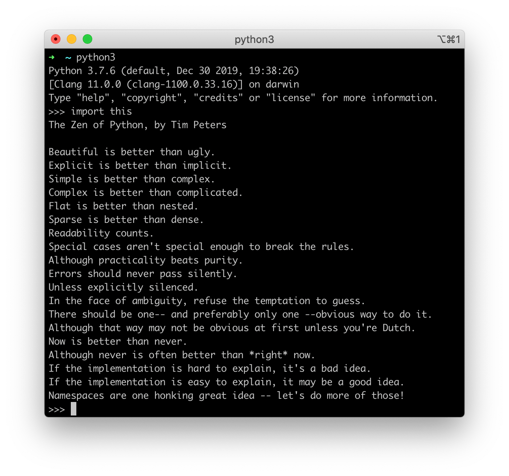

I like a lot of the principles that are built into the programming language Python. Some of the principles are also applicable to “real” life.

They’re a bit hidden and most people don’t know them and have never seen them. They’re easy to get as they’re built into every python interpreter.  
Simply start python and enter `import this`:

The Zen of Python, by Tim Peters

*For better readability I’ve formatted (and numbered) them here*

## The Zen of Python, by Tim Peters

1. Beautiful is better than ugly.

2. Explicit is better than implicit.

3. Simple is better than complex.

4. Complex is better than complicated.

5. Flat is better than nested.

6. Sparse is better than dense.

7. Readability counts.

8. Special cases aren’t special enough to break the rules.

9. Although practicality beats purity.

10. Errors should never pass silently.

11. Unless explicitly silenced.

12. In the face of ambiguity, refuse the temptation to guess.

13. There should be one– and preferably only one –obvious way to do it.

14. Although that way may not be obvious at first unless you’re Dutch.

15. Now is better than never.

16. Although never is often better than *right* now.

17. If the implementation is hard to explain, it’s a bad idea.

18. If the implementation is easy to explain, it may be a good idea.

19. Namespaces are one honking great idea — let’s do more of those!
