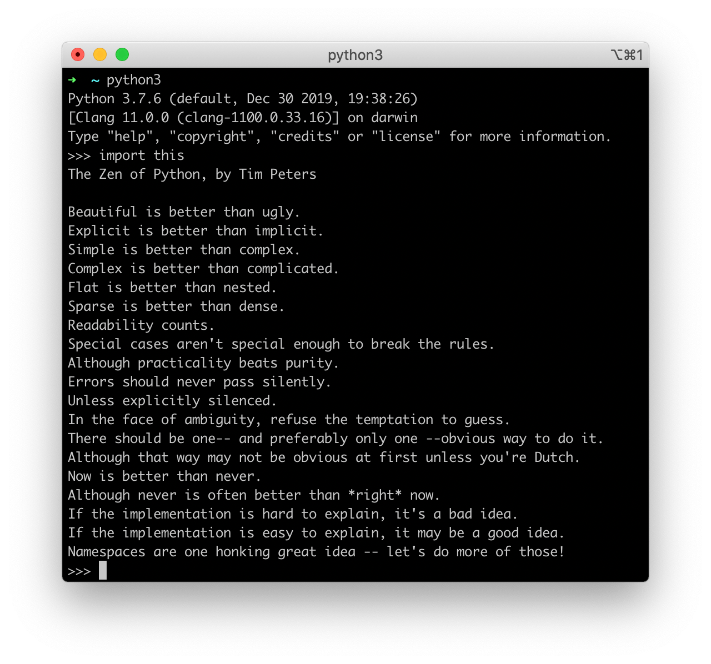

I like a lot of the principles that are built into the programming language Python. Some of the principles are also applicable to “real” life.

They’re a bit hidden and most people don’t know them and have never seen them. They’re easy to get as they’re built into every python interpreter.  
Simply start python and enter `import this`:

*For better readability I’ve formatted (and numbered) them here*

## The Zen of Python, by Tim Peters:

1. Beautiful is better than ugly.
2. Explicit is better than implicit.
3. Simple is better than complex.
4. Complex is better than complicated.
5. Flat is better than nested.
6. Sparse is better than dense.
7. Readability counts.
8. Special cases aren’t special enough to break the rules.
9. Although practicality beats purity.
10. Errors should never pass silently.
11. Unless explicitly silenced.
12. In the face of ambiguity, refuse the temptation to guess.
13. There should be one– and preferably only one –obvious way to do it.
14. Although that way may not be obvious at first unless you’re Dutch.
15. Now is better than never.
16. Although never is often better than *right* now.
17. If the implementation is hard to explain, it’s a bad idea.
18. If the implementation is easy to explain, it may be a good idea.
19. Namespaces are one honking great idea — let’s do more of those!

## Why this list outlived the code

Tim Peters wrote these 19 aphorisms as a half-joke for Python developers, but they’ve quietly become one of the best short manifestos on how to build *anything* — software, companies, teams. I’ve come back to them again and again over the years, and most of them have nothing to do with semicolons or indentation.

**Explicit is better than implicit.** This is a leadership principle before it’s a coding one. Most dysfunction on a team comes from assumptions nobody said out loud — who owns what, what “done” means, why a decision was made. Make it explicit. Say the awkward thing in the meeting rather than the parking lot afterwards. Ambiguity is cheap to create and expensive to live with.

**Simple is better than complex. Complex is better than complicated.** There’s an important difference here. Complexity is sometimes unavoidable — a hard problem is a hard problem. But *complicated* is what happens when you bolt accidental mess on top of essential difficulty. The same is true of org charts, processes, and product roadmaps. Fight to keep things simple; when you can’t, at least keep them honestly complex rather than needlessly complicated.

**Errors should never pass silently — unless explicitly silenced.** In code, a swallowed exception is a bug waiting to surface at the worst possible moment. In a company it’s the missed number nobody flags, the unhappy customer who just churns instead of complaining, the teammate who’s quietly checked out. Surface problems early and on purpose. And when you *do* decide to ignore something, make that a conscious choice, not a default.

**Now is better than never. Although never is often better than *right* now.** This is the whole tension of entrepreneurship in two lines. Bias toward shipping — perfect plans that never leave the building help no one. But velocity isn’t an excuse to act before you’ve thought. Knowing which of the two halves applies to a given decision is most of the job.

**Readability counts. If the implementation is hard to explain, it’s a bad idea.** If you can’t explain your strategy, your architecture, or your pitch simply, that’s usually a signal the thing itself is muddled — not that your audience isn’t clever enough. Clarity is a forcing function for good thinking.

The whole list rewards a particular temperament: humble about complexity, allergic to hidden state, biased toward doing the obvious thing well. That’s a pretty good description of how I try to build, and it’s why `import this` is still the first thing I type when I want to remember what good looks like.

* * *

*Image from https://www.datacamp.com/blog/lessons-from-the-zen-of-python*
