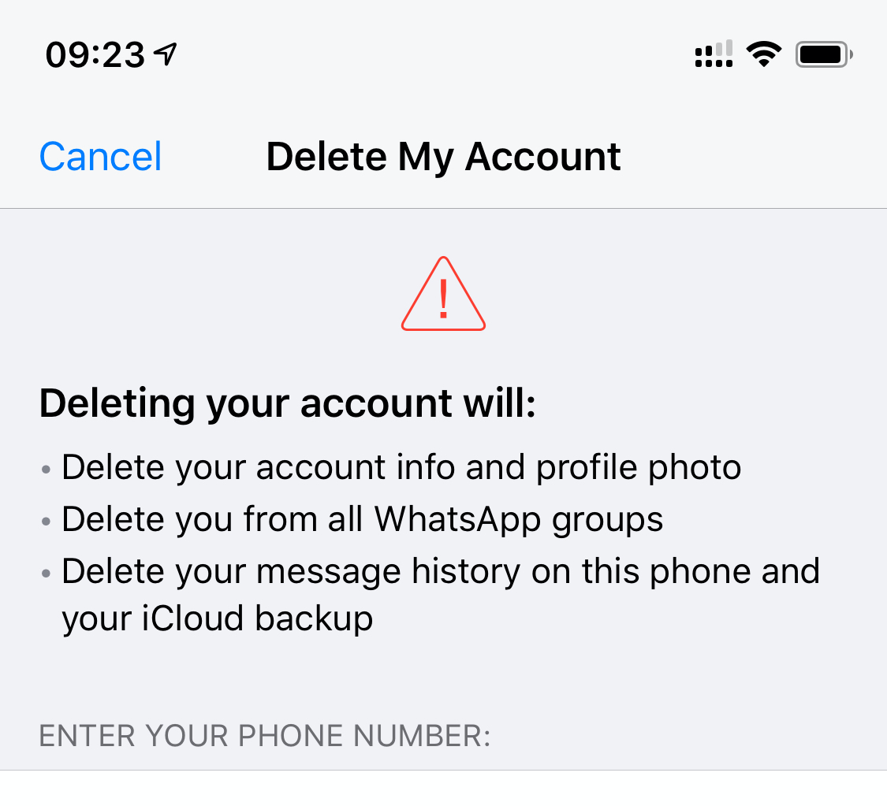
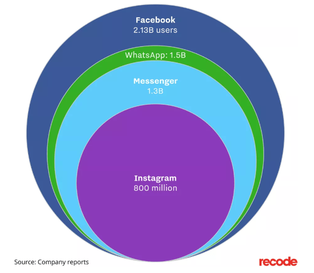
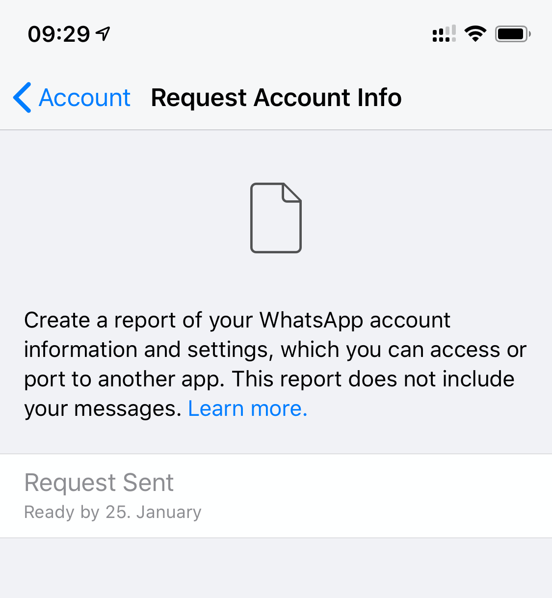

>

TL;DR: I’m deleting my Whatsapp account.
You can still reach me via[Signal](https://signal.org/)([iOS](https://itunes.apple.com/us/app/signal-private-messenger/id874139669),[Android](https://play.google.com/store/apps/details?id=org.thoughtcrime.securesms)), phone, SMS/iMessage,[E-Mail](mailto:jodok@batlogg.com)or on[Twitter](https://twitter.com/jodok).Bye, bye.

Undoubtfully – it’s a very handy tool. More than 1.5 billion people use it. Free cross-platform messaging, free group chat, free calls, free video calls. This was (and is) game-changing. Revolutionary 10 years ago!

Extremely impressive backend technology, written in Erlang. In 2015 WhatsApp had only 50 engineers handling 900M users. That was roughly one year after Facebook acquired WhatsApp for $19BN. I honestly admired the team as I know what it means to build a messaging service for millions of users.

## Wait. $19BN for a free service?

WhatsApp is Facebooks second biggest property. Facebook is making money with the data for their users – **YOUR DATA**.

[https://www.vox.com/2018/2/1/16959804/whatsapp-facebook-biggest-messenger-instagram-users](https://www.vox.com/2018/2/1/16959804/whatsapp-facebook-biggest-messenger-instagram-users)

The price is too high. Your messages, your messaging metadata, your friends, your connections,…
Guess why the WhatsApp Founder Brian Acton left Facebook 2018 – 4 years after the acquisition and left $850M on the table?

>

“I sold my users’ privacy… I live with that every day”[CNBC Interview](https://www.cnbc.com/2018/09/26/whatsapp-co-founder-explains-why-he-left-facebook.html)with Brian Acton

## The tipping point

>

The encrypted message from the number used by Mohammed bin Salman_(Saudi crown prince)_is believed to have included a malicious file that infiltrated the phone of the world’s richest man, according to the results of a digital forensic analysis.The Guardian (January 2020):[Jeff Bezos phone got hacked via WhatsApp](https://www.theguardian.com/technology/2020/jan/21/amazon-boss-jeff-bezoss-phone-hacked-by-saudi-crown-prince).

Jeff Bezos got a video message. That video message infiltrated the phone, and the hackers could get access to all content on this phone.

- messages
- photos
- call history
- location (history)
- contacts
- …

But wait – you’ve also voluntarly granted these permissions to WhatsApp. Are you sure you trust Facebook?

**Privacy comes at a price**. I’m willing to pay the price. Even if Billions of users act otherwise and take part in that game.

## Becoming Facebook free

This is the logical next step on my journey to become Facebook (the company) free. [After deleting my Facebook account](https://batlogg.com/2020/01/facebook-the-end/) I’m now deleting my Whatsapp account. I’ve requested my data, it’s ready today.

__

Instagram is next.

_I encourage you to do the same. It feels great and will feel great in future._
