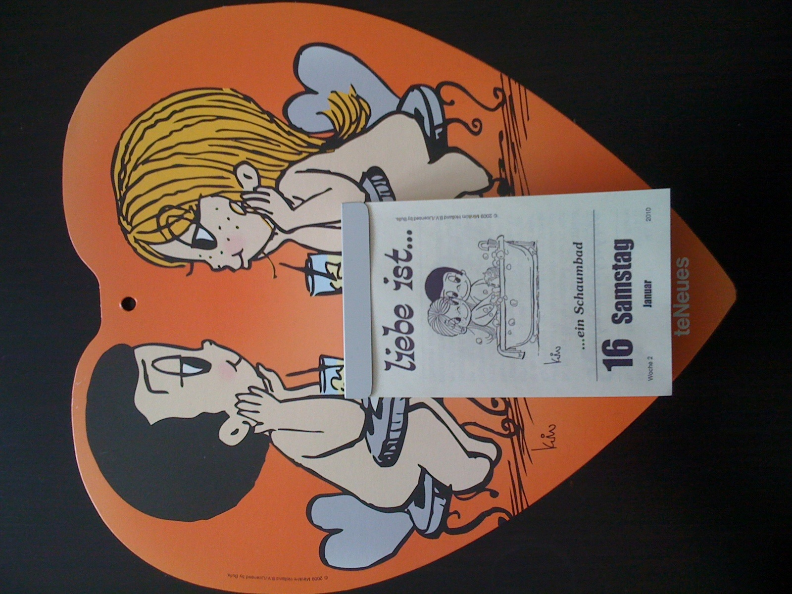

(especially after being a long time outside in the cold)

Liebe ist, January 16th 2010, Berlin

## What is love?

It’s easy to say: I love my wife, I love my job, I love Pizza or I love this music. How valid are the ancient, greek definitions family love (storge), platonic/friends love (philía), self love (philautia), romantic love (éros), guest love (xenia) and divine love (agápe) nowadays?

I recently came across the study of Tim Lomas “[The flavours of love: A cross-cultural lexical analysis](https://www.researchgate.net/publication/322241158_The_flavours_of_love_A_cross-cultural_lexical_analysis)“. He was analyzing words for love in many different languages and based on this analysis describing different flavours (that can be combined). E.g. Koinonia – the feeling if you’re being taken away by the emotions in a group for a short time. Wikipedia has [all the theory](https://en.wikipedia.org/wiki/Love) about love.

## Business love

I’m not sure what category to use when I talk about what I love in business life. But sometimes it feels like taking a foam bath after an afternoon in the cold!

- The feeling when **puzzle pieces fall into place**. You’ve started something hard, complex, distributed and you and the team have been working hard for a long time – and at some point things suddenly and quickly fit neatly together. I love that feeling.
- The moment you’re **exiting the “valley of tears”**. You had a series of bad events/messages/pity. Like it won’t ever stop and everything is going to be over. And then something game-changing is on the horizon. You realize the streak of bad luck is over. BUT you stay just a bit longer in that bad state to extend the joy of getting out of this.
- Giving trust ahead and empower people. Against all odds you decide to **trust** into the person – and then you’re **rewarded** for that decision later. Investing that social capital and earning it back later.
- Having **impact on people**. The moments I get wet eyes in the office are rather rare. But thinking back it were the moments where people (or their spouse) said thank you for the changes/personal development I enabled or I nudged them into. I’m still touched.
- **Let other shine**. Of course I love the moment I’m the winner and stand in the limelight in front of thousands of people. But the more longlasting and even better feeling is if other shine – not only, but also because you coached, enabled and empowered them.
- Waking up early, full of energy and **starting something new**. Priceless!

## **Heureka!**

I’ve got it! The happenings, situations, feelings in business live I really, really love are connected to my definition of entrepreneurship:

> Entrepreneurship is the pursuit of opportunity without regard to resources currently controlled
>
> Prof. Howard Stevenson, Harvard Business School

I love all the moments of it: **Seeing an opportunity, pursuing it and seeing it working out** – that’s where my inner Jodok is tipping his toes into the foambath after a long walk in the cold.
