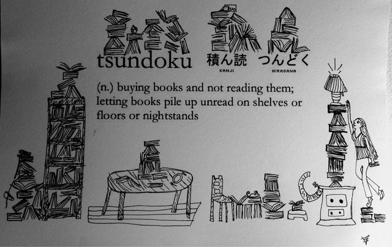
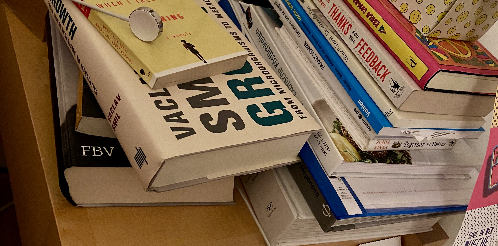

Each language has some special words that can’t be translated to other languages. I think this expresses a lot the culture of these countries and people.

Japanese seems to be very powerful when it comes to describe things and situations. For example Haruki Murakami – one of my favorite authors – doesn‘t like to speak on stage in his mother tongue japanese. The reason? He needs to much brain power to think about the best/correct word among the different options to use in the sentences. This prevents him getting into the real flow of telling the story.

Long story short, I wanted to shares the books I‘m reading and even more plan to read. Then I remembered that there‘s a beautiful japanese word to describe books you‘ve bought, but not yet read:

[http://www.openculture.com/2014/07/tsundoku-should-enter-the-english-language.html](http://www.openculture.com/2014/07/tsundoku-should-enter-the-english-language.html)

Books… written, condensed knowledge. We don’t read enough. We need to read more. Most of situations in life already happened once. And intelligent people focussed on describing these problems and solutions.

I plan to maintain the list and grow it – and as we move on also add more details/my review to the books.

_If I’m linking to a book I’m not using affiliate links and I’ll link to my local books store or to the electronic version in the Apple ecosytem._

## I’m reading/listening

- “[What You Do Is Who You Are](https://books.apple.com/at/audiobook/what-you-do-is-who-you-are/id1483096559?l=en)” by Ben Horowitz
It’s a book about culture, using a couple successful examples from history and giving input on how to build your own company culture. So far I didn’t learn too many new things, but I’m only through by 1/4.

## I (recently) read/listened to

- “[Handbüchlein der stoischen Moral](https://books.apple.com/at/book/handb%C3%BCchlein-der-stoischen-moral/id1119702841?l=en)” by Epiktet (german e-book)
After listening to “The Manual” (below) I wanted to have the written, german version of Epictetus (Epiktet). It’s a bit harder to read in the original translation, but I really like it.
- “[The Manual](https://books.apple.com/at/audiobook/the-manual-a-philosophers-guide-to-life-unabridged/id1240012106?l=en)” by Epictetus, Ancient Renewal and Sam Torode (Audiobook)
Sam Torode did a great job to translate/transform the teachings of Epictetus into contemporary english. I out myself that like the concept of stoicism and try to live by it. Even if you say: “Oh, he’s now a philosopher” (Hint: read the book). I purchased the audio book – but I recommend the printed version as it’s really condensed information.
- “[Never Split the Difference](https://books.apple.com/at/audiobook/never-split-the-difference/id1466928726?l=en)” by Chris Voss (Audiobook)
I love negotiations and to learn more and more about it. For a long time I thought that the Harvard negotiation technique is the best way. But unfortunately not all negotiations are based on win-win situations. That’s where this book comes in. I know for sure I’ll enroll in Chris’ online class asap!
- “[Playing To Win](https://www.brunnerbuch.at/list/9781422187395): How Strategy Really Works” by A.G. Lafley and Roger L. Martin (Hardcover)
After reading that book I decided to use the tools within Crate.io as well. It totally makes sense. Highly recommended. You can also buy the tooling around it (video material, Powerpoint slides). We bought the whole package.
- “[Verhandeln im Grenzbereich](https://books.apple.com/at/audiobook/verhandeln-im-grenzbereich-strategien-und-taktiken/id1473287351?l=en)” by Matthias Schranner
10 years ago I had the opportunity to be part of a negotiation training with Matthias. Unfortunately I had to cancel it in the last second. Since that time I wanted to learn more about his approach. Finally I saw Matthias Schranner on stage/in a workshop at bits&pretzels in Munich and decided to listen to his book afterwards.
- “[Hit Refresh](https://www.brunnerbuch.at/list/9780008247652)” by Satya Nadella
Earlier this year I had the opportunity for a meeting with Satya Nadella, CEO of Microsoft. And I wanted to be prepared and understand how he thinks. The book explains a lot about the “new” Microsoft.
- „[What I Talk About When I Talk About Running](https://en.wikipedia.org/wiki/What_I_Talk_About_When_I_Talk_About_Running)“ by Haruki Murakami
1.5 years ago I started to run. My sister gave me the book as she knew my love for Haruki Murakami. It’s really great to see how he’s connected to running.

## I’ve purchased/got, but not yet read/listened to

- „[The Most Important Point](https://www.indiebound.org/book/9781683641605)“ by Edward Espe Brown (Hardcover)
Unfortunately I missed the cooking and meditation sessions with Edward at my sisters place so far. But his book is #1 on this list.
- “[Die Spionin](https://www.brunnerbuch.at/list/9783257244106)” by Paulo Coelho (german, Hardcover)
Christmas present
- “[A Guide to the Good Life](https://books.apple.com/at/audiobook/guide-to-good-life-ancient-art-stoic-joy-unabridged/id734031232?l=en): The Ancient Art of Stoicism” by William B. Irvine (Audiobook)
Nomen est omen.
- „[Thanks For The Feedback](https://www.brunnerbuch.at/list/9780670922628)“ by Douglas Stone and Sheila Heen
I’m half way through – but other books took over. I should urgently finish it.
- „[Growth](http://vaclavsmil.com/2019/09/17/growth-from-microorganisms-to-megacities/)“ by Vaclav Smil (Hardcover)
present of Joe, Crate.io advisor. seems like a pile of work 🙂
- “[Hiring For Attitude](https://www.indiebound.org/book/9781259860904)” by Mark Murphy
- “Reinventing Organizations” by Frederic Laloux
- „Hippie“ by Paulo Coelho
- „Der unbewußte Gott“ by Viktor Frankl
- „Gewinnen um zu Siegen“ by Franz Vonier
- „Together is better“ by Simon Sinek
- „Tesla“ by Bernard Carlson

## I consider to read/listen

- “[The Tao of Seneca: Practical Letters from a Stoic Master](https://books.apple.com/us/audiobook/tao-seneca-practical-letters-from-stoic-master-volume/id1075527494)” by Seneca (presented by Tim Ferris Audio)
- “New Work Needs Inner Work” by Jona Breidenbach and Bettina Rollow
- “Flow” by Mohaly Csikszentmihalyi

* * *

Please let me know if you suggest a book by tweeting a reply!
