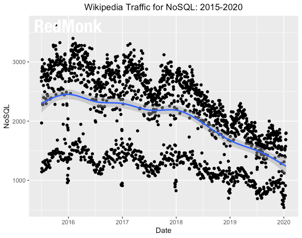

Recently I came across this tweet of Steve O’Grady _(he helped to found Redmonk, a research firm I really value highly)_.
https://twitter.com/sogrady/status/1218280163089289216

Especially this Graph stroke me. This is what I predicted 6 years ago. NoSQL isn’t the solution. And one of the main reasons we’ve built [CrateDB](https://crate.io/).

Providing a **SQL interface to a NoSQL architecture** was and is one of the key and core ideas of CrateDB. CrateDB is purpose-built to scale modern applications. SQL is a major component of that.

The first wave – and the reason SQL was invented – were relational databases. The start was SEQUEL, invented around 1977 by IBM for System R. SQL1 became an ANSI standard in 1986, in the 2003 Version Window functions were added and SQL:2016 got JSON support.

Glad to see that SQL is back still strong. There are many reasons why it is great and we fully rely on it. But the main point to talk about:

## It’s standardized.

>

“The good thing about standards is that there are so many to choose from.”Andrew S. Tanenbaum

Over the past 20+ years some of the brightes computer scientists thought about how to best work with data. SQL has 4 language subcategories:

**Querying Data (DQL)**
_(CrateDB’s [querying](https://crate.io/docs/crate/reference/en/latest/general/dql/index.html) commands)_

That’s what you do most of the time. CrateDB excels when it comes to **querying** data. Nowadays real-time analytics usecases of require aggregations (SELECT SUM(revenue)) out of a table (FROM my_table) that is potentially large (billions of rows) at are limited to a subset of these rows by a filter clause (WHERE ts>myts AND id=myid). Benchmarks show that we consistenly outperform other query engines for these types of queries. Add JOINs to the mix and the complexity explodes – read about the complexity involved to make that [really fast](https://crate.io/a/lab-notes-how-we-made-joins-23-thousand-times-faster-part-one/). Not only on standard data types, but also on modern things like geospatial data.

**Manipulating Data (DML)**
_(CrateDB’s [manipulating](https://crate.io/docs/crate/reference/en/latest/general/dml.html) commands)_

Correct, to be able to query data, you need to start with **writing**  data to the database, in single rows, in batches, via bulk load, updates  or from other queries). CrateDB is fully standard compliant, the only  slight difference is based on the [eventual consistent](https://en.wikipedia.org/wiki/Eventual_consistency) model (also read about [optimistic concurrency control](https://crate.io/docs/crate/reference/en/latest/general/occ.html)) that CrateDB uses: it might take up to the [REFRESH_INTERVAL](https://crate.io/docs/crate/reference/en/latest/general/dql/refresh.html) until records are fully considered in results (selecting by primary key is always consistent).

**Defining Schemas (DDL)**
_(CrateDB’s [definition](https://crate.io/docs/crate/reference/en/latest/general/ddl/index.html) commands)_

Here’s where on needs a bit more that the original SQL standard had in. We’re storing JSON data and need the possibility to define object columns (that can have a strict schema, a dynamic schema or a simply not indexed). Btw. schemas are a great idea – storing data without a schema is just postponing problems.

When it comes to scaling to large amounts of data, the concepts of [sharding](https://crate.io/docs/crate/reference/en/latest/general/ddl/sharding.html), [partitioning](https://crate.io/docs/crate/reference/en/latest/general/ddl/partitioned-tables.html) and replication are key. Here’s where the knowledge of an database administrator is needed. In contrast to a traditional database, where you can change more aspects of a table after creation, you need to think of and define more settings beforehand. I don’t think this is a problem, all of you that ever were forced to do hour long schema migrations where the database was locked – will agree.

**Rights and Transaction Control (DCL, DTL)**

Now we’re talking about differences. Traditional OLTP databases and their workloads heavily rely on transactions and fine-grained permissions. But this comes at a high price (performance, speed, concurrency ). A price one in the IoT or Timeseries space doesn’t want to pay. Especially because the yield is low. Therefore CrateDB supports user-management, but no further functionality (yet).

## SQL-99 Complete, Really

In case you want to learn more about SQL or look up some reference documentation – at Crate.io we’ve acquired the rights to republish the fantastic [SQL-99 Complete, Really](https://crate.io/docs/sql-99/en/latest/index.html) book. So for all oldskool SQL fanbois – here’s a teaser – World’s Longest SQL Poem (for obvious reasons) All the snake-oil peddlers say, there's a fast and easy way,
To get your SQL program up and running,
But they're silent re the traps, that cause subtly buggy apps,
For to catch the unaware a chasm's yawning!

Date-arithmetic exceptions, auto-rollbacked disconnections,
Bit precisions, overflows, collate coercions,
And how NULL affects your summing, for to keep your DB humming,
You must know what happens in all vendors' versions!

Should this field be DOUBLE PRECISION?
Will logic rules soon see revision?
By the ANSI:Databases sub-committee?
When you DROP should you CASCADE?
How are NATURAL joins made?
Re UNIQUE-keys matching check the nitty-gritty!

Yeah the true and standard facts, you'll avoid those later hacks
That make Structured Query Language such a bore,
You'll find tips and charts aplenty, in this one-thousand-and-twenty
Four page volume (with an index), and yet more!

Author anon (also for obvious reasons)
