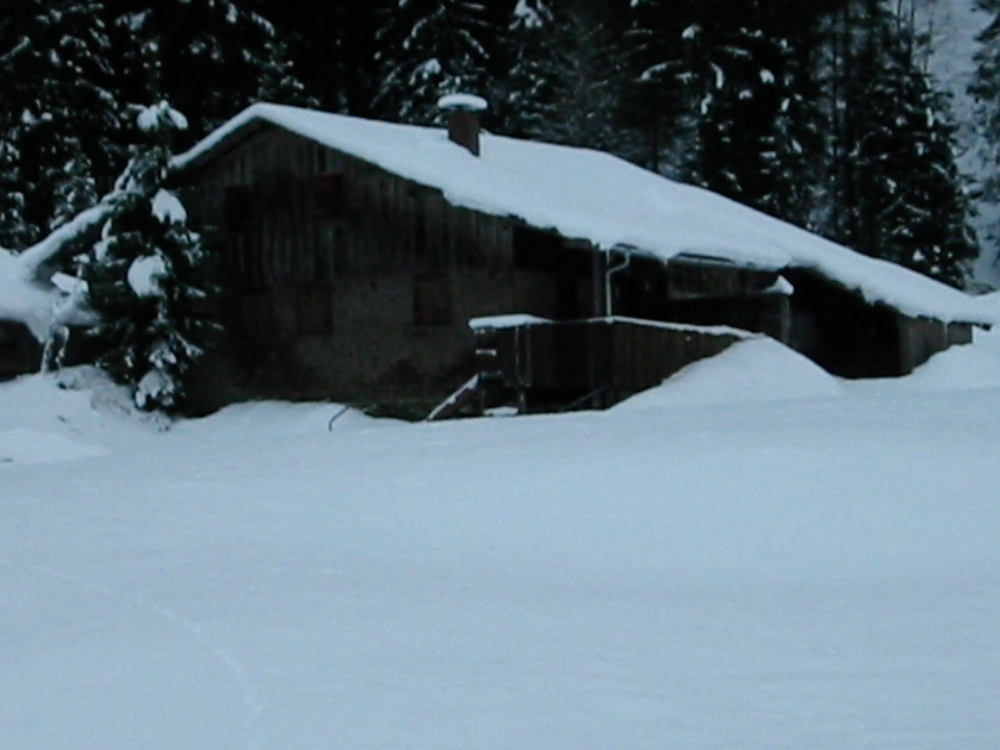
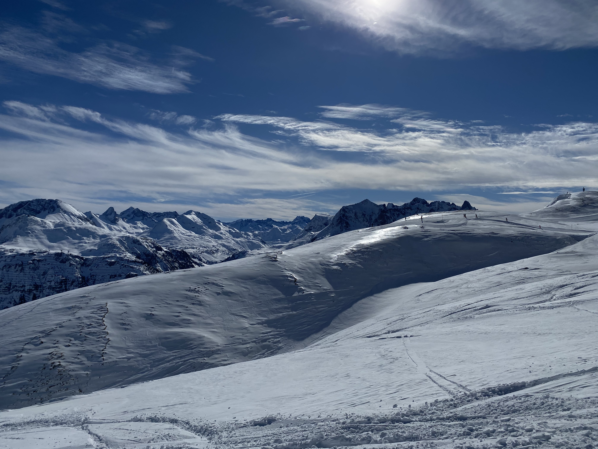

The above picture was taken ~18:30 in February (it was almost dark). Schafberg/Mehlsack in Zug look very different when lighted that way. Beautiful.

The iPhone 11 Pro camera is just amazing. I’m impressed when I see how much the quality of the photos taken has improved. Recently I used the night mode for the first time. \
When it comes to shooting things that are dark and light, the iPhone also finds a perfect balance. Mystic.

*Chapel in the dark winter*

As comparison I tried to find some older pictures, and here’s what I found (roughly 20 years old, shot on an Digital IXUS – a really good compact camera at this time).

*Schoppernau, darkish – evening, 20y ago*

The crispyness of pictures taken is just incredible. I’m excited to see how this evolves going forward.

*Bright winter landscape*
