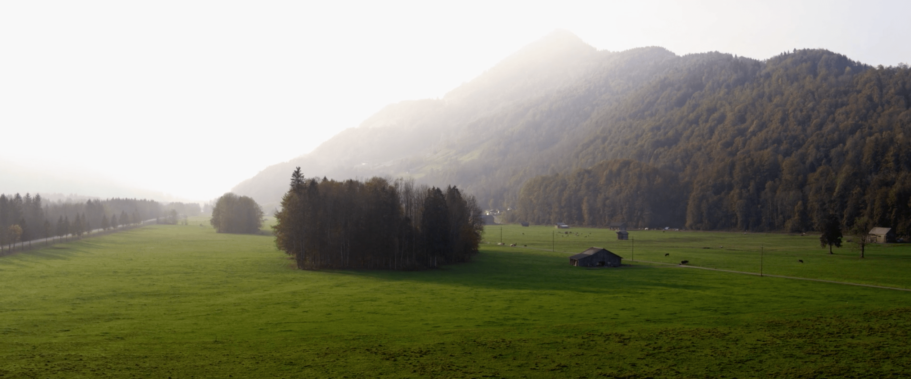

A couple of weeks ago my friend “Menze” a.k.a. Gerhard Beer from Hittisau introduced me to the great people from [Digital Instinct](https://www.digitalinstinct.at). As many of us they were impacted by COVID-19 as well. However every challenge also unlocks a lot of potential.

The movie (german) is about you, how you can unlock potentials **NOW**, just do it. Let yourself be inspired:

[https://digitalinstinct.at/onatree](https://digitalinstinct.at/onatree)

There business is to make films for others. However, they decided to finally devote their talent and passion to create a film for themselves. And share it with the world.

I’m one of multiple protagonists. It was great to see the perfectionism and love for detail the team put into the movie. You don’t really see them in the movie, therefor I’d like to show them here:

But even for my small contribution we spent close to a full day in the Forest, with my Bees and in the office to capture a couple of impressions.

The result is marvelous! Watch the full movie on the [Digital Instict Website](https://digitalinstinct.at/onatree).
