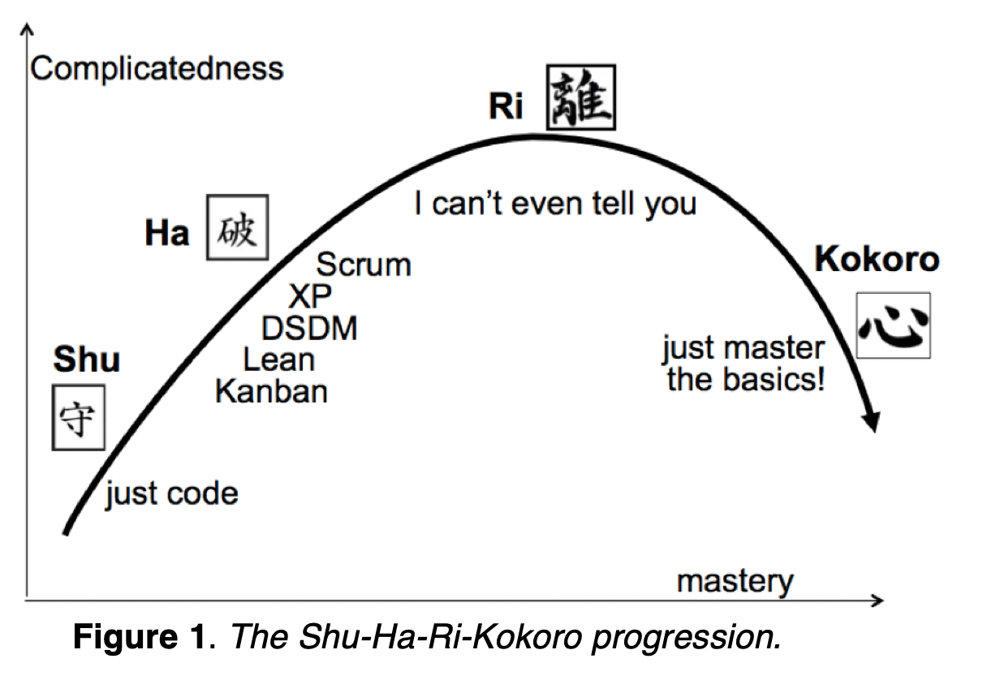

Please take a couple of minutes and read the fabulous essay Sabrina Orah Mark wrote in her [Happily Column](https://www.theparisreview.org/blog/2020/05/07/fuck-the-bread-the-bread-is-over/). Her Blog focuses on fairy tales and motherhood. Within the many things that resonate in her post, one thing struck me most:

It’s about learning. Why are fairytales so important for learning, and why you need to curse “fuck the bread” sooner or later!

Enter Japanese Martian Art – Aikido. **Shu-Ha-Ri** is a concept describing the steps to mastery. I came across it a couple of years ago, when [Alistair Cockburn](https://en.wikipedia.org/wiki/Alistair_Cockburn) took away my Scrum blinders.

> *shu* (守)
>
> protect, obey

This is the very first stage of learning, you apply traditional wisdom, you learn fundamentals, techniques, heuristics, proverbs. Think of children baking their first simple cake. Mine was a marble cake (“Marmorkuchen”). You strictly follow the recipe *(If you’re not into baking, [watch Karate Kid](https://www.youtube.com/watch?v=fULNUr0rvEc))*:

1. Mix 125g of butter until it is creamy.
2. Add 3 eggs and 120g of sugar. Mix until creamy.
3. Add 170ml of milk and half a pack of baking soda
4. Split in two bowls and add cocoa powder into one half
5. Fill in buttered cake tin and fill with alternating dough
6. Bake 50mins at 180°C

It fits like a shu (“shoe”). You do exactly as said, you’ll get a consistent result. It’s like a fairy tale. You walk through a dangerous forest, you don’t leave the path, you are ok.

Scrum is another great example for a Shu recipe. You create a backlog, you estimate and prioritize stories, you do sprintplannings, daily standups, reviews, retros. Timeboxed, with the right roles present. If you follow exactly the rules it’s guaranteed that you’ll have a consistent result.

Ok, we’re done with learning! You’ve learnt a technique. Many people stop here. And like in **a fairytale they live happy until the end**. But, Oh wait!

> *ha* (破)
>
> detach, digress

> In fairy tales, form is your function and function is your form. If you don’t spin the straw into gold or inherit the kingdom or devour all the oxen or find the flour or get the professorship, you drop out of the fairy tale, and fall over its edge into an endless, blank forest where there is no other function for you, no alternative career.

*from [Sabrina Orah Mark’s Blog post](https://www.theparisreview.org/blog/author/somark/)*

No worries. There is more! Sometimes it’s necessary to yell “**Fuck the Bread**“. And break with the habits. Maybe Hänsel and Gretel walked the forest 100 times. And at some point they dare to take a different path, and guess what – it’s safe as well and more beautiful, and even faster! In this stage, curiosity, or the limitations of the given technique (think of cooking) cause you to experiment. Break with the norms. You’re collecting techniques. It’s the learning stage.

Back to cooking: After dozens of marble cakes *(ask my mom!)* I gradually left common recipes and I consider myself being a chef at the ha level in most cases – I can comfortably leave the exact recipe, I’m experimenting (and failing) – and in some rare moments I’m creating exciting new things! For complex szechuan recipes or a Ottolenghi masterpiece with dozens of ingredients I might fall back to shu level.

Throughout this stage you gradually separate from the strict form of the shoe “Shu”. Make sure you work on your habits, because:

> In the first 30 years, you make your habits. For the last 30 years of your live, the habits make you.

*Steve Jobs*

> *ri* (離)
>
> leave, separate

At some point you are able to fully detach from the form. You can’t say why you chose a specific technique. You just do it naturally, no recipe, no preparation needed. Martin Broadwell describes it as **unconscious competence**. The easier you can leave the form, the more often you detach from it, the closer you are to the ri level.

Translated to learning, you now invent and blend techniques. The magic happens at your very own “**You at your best**” moments, where there are in the flow and time and space disappear.  
Earlier I spoke about “Fuck the bread”. You’re past the point where you care about that. But you’re anything else but careless and you’re neither ruthless as well.

Dalai Lama state? Can anything come after? The Shu-Ha-Ri ends here,

---

but Alistair Cockburn *(mentioned earlier)* is on the journey to dive deeper and find out what could come after:

> Kokoro ( 心)
>
> essence, heart

Kokoro is used in the writings of the 17th century samurai master Miyamoto Musashi to refer to the essence or heart of the samurai. It’s the radically simplified essence of a skill area. The figure below shows how practice starts off simple (Shu, learn one technique), grows more complicated as one learns more techniques (Ha, collect), becomes indescribably complicated at the Ri level (invent and blend), and finally takes on a simple form (Kokoro) when given by the advanced teacher.

*Alistair Cockburn “[Heart of Agile](https://alistair.cockburn.us/wp-content/uploads/2018/02/The-Heart-of-Agile-Technical-Report.pdf)“*

By teaching others you [improve your mastery](https://www.forbes.com/sites/amyanderson/2016/01/06/the-fastest-way-to-achieve-success-is-to-first-help-others-succeed/). Kokoro represents the teaching stage of the advanced practitioner. It is characterized by the advice **“Just master the basics.”**

- The marble cake.
- Hänsel and Gretel following the path
- Following the essential rules of Scrum

> “You know what, Mama?” he says. “You’d make a really good teacher.” “Thank you,” I say. And then I show him how to draw a *bet*.

*Closing words of Sabrina Orah Mark in her [column](https://www.theparisreview.org/blog/2020/05/07/fuck-the-bread-the-bread-is-over/)*

---

*Right now my learning journey is getting better in coaching, active listening, … and I’m glad to learn the basics from masters like [Matthias Ehrhardt](https://designingtalent.us) or [Dieter Rösner](https://www.dieter-roesner.com).*

* * *

*Image Source: Hänsel and Gretel, by Alexander Zick*