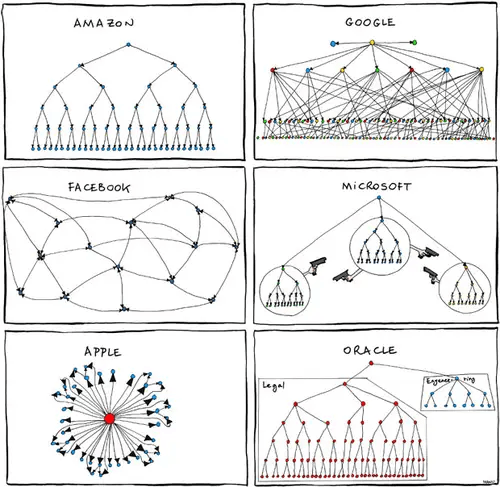

I received some feedback and questions about [my post](https://batlogg.com/2021/04/the-marks-of-a-rational-person/) on leadership decisions at a workplace, and why I believe that many societal and political topics don’t belong to my workplace. _(A clarifying side note: I wasn’t saying Basecamp is right or wrong. And banning and forbidding speech is a bad idea in general)_.

I’ve been chewing parts of this post for a while. But as [about one third](https://twitter.com/_breeeeen_/status/1388198260603506693) of the Basecamp workforce left after their leaders Jason/David announced some [cultural changes](https://world.hey.com/jason/changes-at-basecamp-7f32afc5) and today Melinda and Bill Gates announced their separation, it was time to push it out.

All of these separations really moved me and over the weekend I spent several hours in reading and researching. It **moved me** because I can personally relate to that very well. In November I left my previous company (~60 employees like Basecamp) and over the last few month ~25 people – of which most of them I hired personally – left the company too.

_(Just to be clear and explicit: I’m not making hints, propose conclusions or draw any parallels to my former company or people involved there. This is rather based being a curious, learning entrepreneur for 30years)._

>

It was the right decision

Companies and their leaders have the right and duty to make decisions. To set their leadership style and their culture. To change it gradually, radically or not at all. And to take the consequences. This isn’t good or bad per se. This is just how it is and how it has to be.

At the point a decision is taken (“Culture Changes”/”Quitting the Job”) – it was **the right decision** for the corresponding party. At the very moment to decide, everybody will take the best decision this person can take, based on the (limited) facts available.

Software engineers in the tech space are well paid (in Basecamp’s case [~220k/year](https://www.glassdoor.com/Salary/BaseCamp-Salaries-E3138625.htm), paying at the [top 10%](https://m.signalvnoise.com/minimum-pay-at-basecamp-is-now-70000/) of San Francisco market rate and will receive up to 6 month of salary if they decide to leave). So they can also decide freely if they want to stay and adopt to the new situation/culture or if they want to move on. It’s also very unlikely they have to pee in bottles while driving delivery trucks or being in physical danger. So it’s pretty safe to assume:

>

People don’t quit a job, they quit a boss.It’s a common saying, but i don’t fully agree.

_(Among the many articles I read, [this HBR article](https://hbr.org/2018/01/why-people-really-quit-their-jobs) reflected my view best, I’m partially paraphrasing it. Also “[What you do is who you are](https://a16z.com/book/whatyoudo/) ([Summary](https://waiyancan.com/what-you-do-is-who-you-are-summary/))” by Ben Horowitz inspired me a lot)._

Strong companies are built around strong cultures. And they will be highly individual, but they will share a couple of patterns. Often they are built around the leaders that craft them. I bet you’ve seen this comic:

Organisations need structure and leadership. This is a good thing and isn’t contradictory to self-organisation, empowerment of the individuals,… Modern leadership styles/principles fully embrace that. I’m stressing that because I strongly believe that so much of a happy/fulfilled workplace is dependent on that connection.

## Changing culture

It’s as simple as that. Different cultures attract different people. Sometimes leadership changes, and therefore a change of talent follows. Or culture starts drifting away and gets recalibrated, which results in churn.

Nothing to worry about. just to be aware of.

## Missing Joy

As leader you need to know what employees enjoy. Where a person can work at their best. People aren’t resources that are slotted into a position. Remember, we spend a good portion of our time awake at work. We need to support everybody to craft their optimal experience at work.

You need to design around them. If people are engaged and come to that energized state that is named **[flow](https://en.wikipedia.org/wiki/Flow_(psychology))**, magic happens. And magic results are just magic! This is only possible if people are in a **safe space**, where they don’t have to worry about many things. Without trust a safe space can’t exist. But how to create trust (Yes, mistrust leads to people quitting their jobs)?

## Shrinking Trust

Strong cultures are **memorable** and based on a set of rules. The simpler and more explicit they are, the better. Because if you’re operating on these set of principles reliably it creates **trust**. An additional benefit of trust is that it makes communication way more effective. Because, if you don’t trust me, all my talking would be useless.

A few of my personal rules that randomly come to my mind: “I do what I say, I say what I do”, “I communicate decisions, as soon as they are taken and don’t hide them.”, “In case of mistakes I’m focussing on avoiding it in future, not on finding who’s guilt it was.”, or to close that heading “Assume every decision is right, as you assume best intentions.”…

Never forget: It’s hard to earn trust and takes time. It’s easy to destroy trust and takes no time.

## Lack of Appreciation

A healthy company has a good, diverse mix of individuals. The doers, introverts, fighters, dreamers, caretakers, listeners, thinkers, tinkerers, silent ones, critics,… As leader I often felt like a Zoo director.

[https://www.mytoys.de/larsen-rahmen-puzzle-45-teile-36x28-cm-tiere-im-wald-10992069.html](https://www.mytoys.de/larsen-rahmen-puzzle-45-teile-36x28-cm-tiere-im-wald-10992069.html)

Assume everybody is doing her/his best. All the time. Therefore everybody deserves their share of appreciation and attention. A “small beaver” can be equally important to a “big roaring tiger” but will leave if he’s not seen and appreciated. No matter how long an employee is with the company, or how important their role is.

## Lack of growth perspective

Bill and Melinda Gates separated after 27 years of marriage because they “no longer believe they can grow together as a couple”.
So, if an employee is asking: “What is my perspective at the company?”, you already missed the point of proactively managing that. If these answers are missing, one will sooner or later quit. On the other hand – providing a clear growth path can do wonders!

* * *

As Leader, don’t delegate diversity and inclusion. It’s your job. As soon you reach a point, where DEI is done for it’s own purpose you lost the connection to the company culture and this leads to dissatisfaction.

There are assholes out there. They might be inside your company. Manage them well. Recognise that you won’t be able to change them. Make sure they do as little damage as possible. As long you have the power. Don’t look away, act.

>

People don’t leave companies, they leave people.Paraphrased from Ben Horowitz’ Book

Oh, btw. I’m about to put together a new team as we speak.

>

People don’t join companies, they choose the people to work with.

[Mail me](mailto:jodok@batlogg.com) or call me if you’re ready to make a choice.
