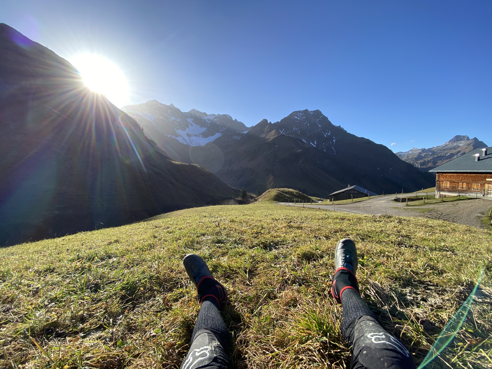
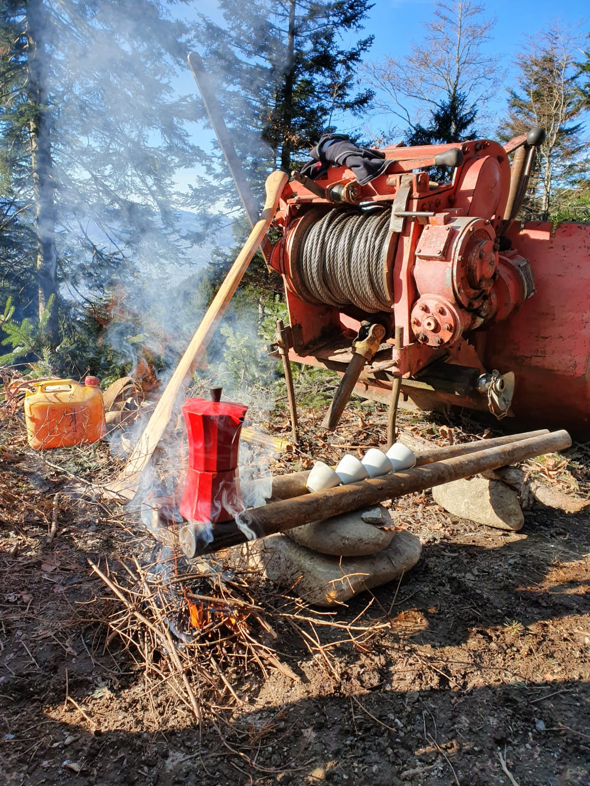
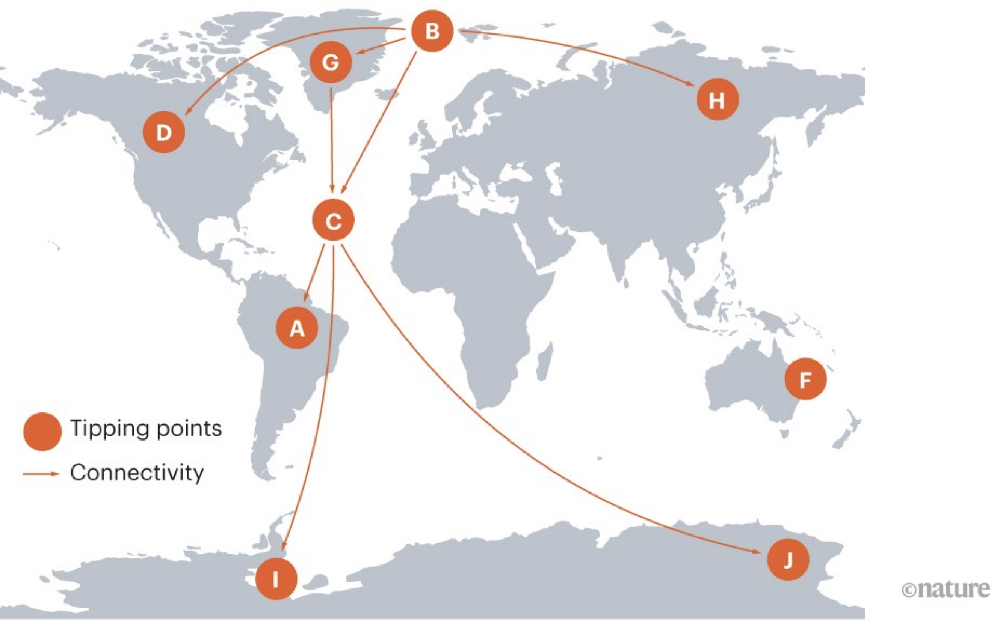
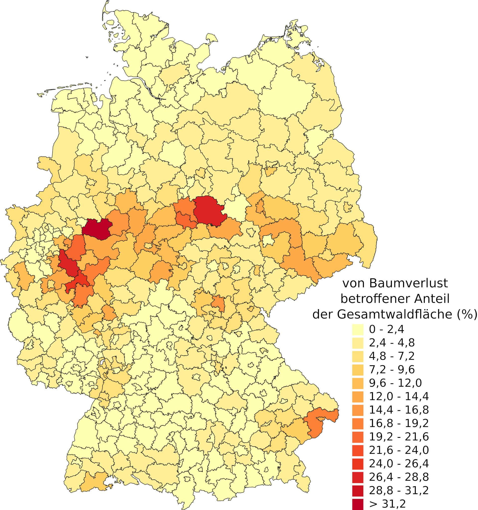
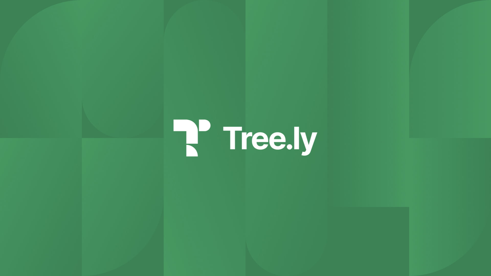
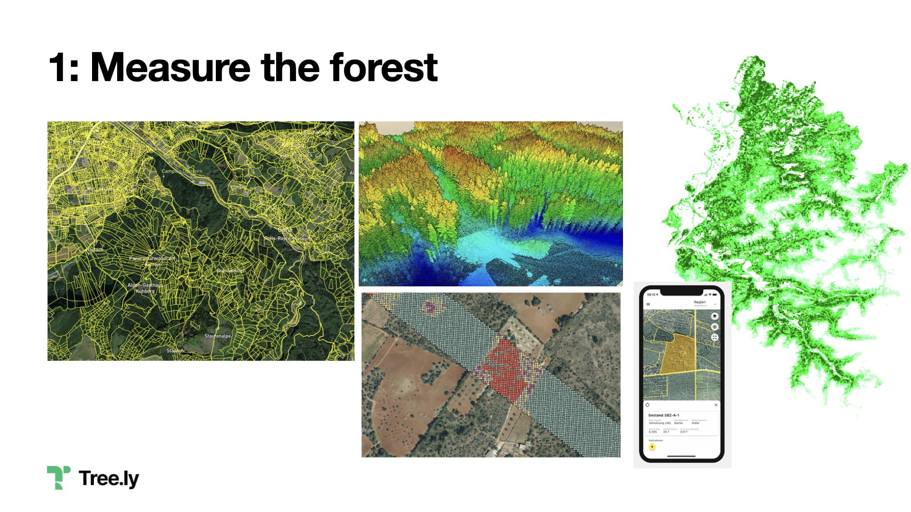
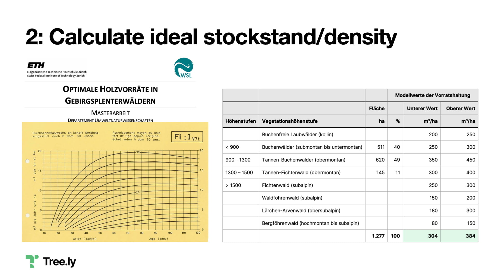
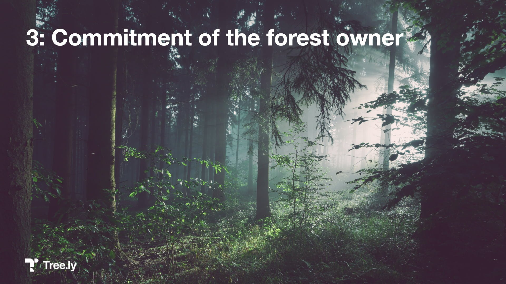
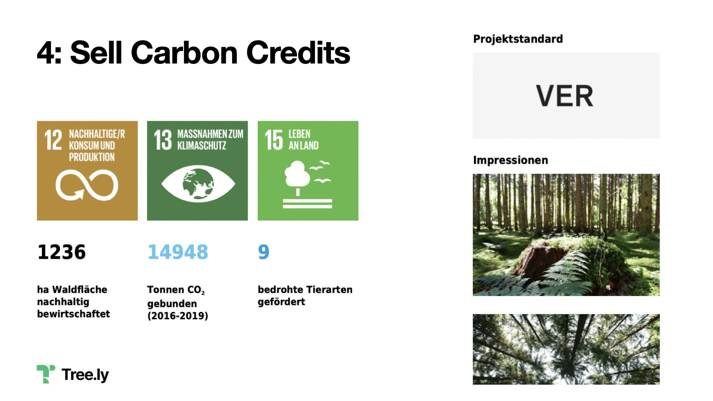
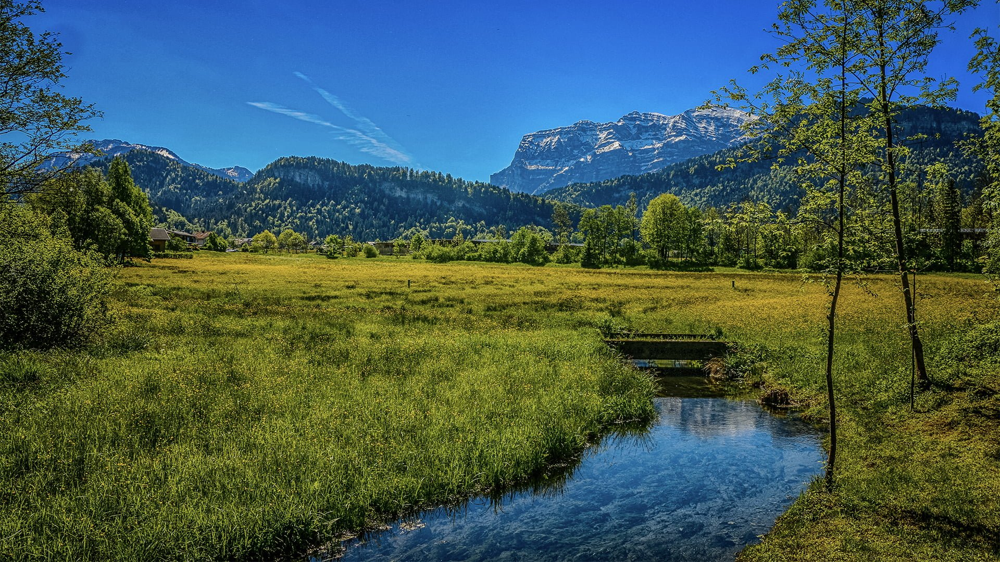

I had the opportunity to speak at [TEDxDornbirn](https://tedxdornbirn.com) about my journey as (serial) entrepreneur and my latest venture [Tree.ly](https://tree.ly), ensuring optimal carbon storage in our forests.

I’m also giving more intimate insights why I’m doing what I’m doing and how I put my values into action. I would love your feedback via Twitter, LinkedIn or E-Mail!

https://www.youtube.com/watch?v=c8M4tDyo3eg

TEDx talk “Saving the Climate with Entrepreneurship”

*For the more text-oriented visitors, I’ve paraphrased (and detailed) my talk. Note the different intro 🙂*

2 years ago, to be exact on February 27th, 2o20, 20:45 Toronto time, I boarded Air Canada’s flight to Munich. I was exhausted, sleep deprived, as this marked the end of a crazy 4-day trip to the San Francisco Bay Area, including 2 red-eye flights east-coast/west-coast because of heavy snow and weather.

Flying twice SFO-YYZ, red-eye.

Little did I know about the changes the next two years would bring.

But it was a super successful trip and marked the end of a month-long marathon to raise capital for my deep-tech startup baby. The final boardmeetings with our future investors were positive, and we were about to secure a **termsheet** in the range of **~$20M**. Holy! That was an incredible feeling! I’ve worked so hard for that. I’ve travelled >60x to San Francisco over the past 15 years, and yet this was one of the few business class flights. In the light of the exhaustion and great success we decided we deserved to spend the extra 1.066 CAD.

This is one of the many high peaks an entrepreneur, running to build a unicorn company, has to climb. The feeling reaching new heights is overwhelming!

> How little did I know in this moment about what the future would bring.
>
> /me dreaming at this time

I’ve built several successful companies and was running some of the largest web properties on this planet.  
I’ve built a 65 people database company from scratch. Out of the small town of Dornbirn, Austria – with hubs in Munich, Berlin, Vienna, Zurich and ultimately headquartered in San Francisco. We’ve made it to Techcrunch Disrupt, been part of the Gartner reports, named by Forbes as one of the most promising companies and won lots of happy customers.

I had all of this.

/me, sitting on top of that hill, crying.

Yet i found myself sitting there, crying on the top of that hill. Asking myself: “**What am i doing here?**“. Something is missing. Perhaps some of you have experience with the same feeling. Live is too short.

Don’t me wrong. It was not completely off – but something was missing. That was my life – and that’s fine. If that was you this would also be fine to continue! But not for me.

I decided to move on to something new after 7+ years. I’ve read so much about that purpose sh.., and heard people saying it, over and over. E.g. from team members, 20y younger than me. But yes – it’s really true!

It was a hard step, as giving up something is always difficult. Over that time I’ve spent many, many hours in nature. Skitouring, hiking, biking, a total of whopping 135.000 vertical meters in that year.

Well deserved coffee break after a hard day working as forester

During that time I’ve also spent a lot of time with my friends dad in their forests and became a semi-professional forester. This helped me a lot to also pause, and to reflect. **It might be clear for you**. For me it took a lot of time. It took a year, with unknown results beforehand. And i also worked with my coaches and friends [Dieter](https://www.dieter-roesner.com) and [Matthias](https://www.autoris.com) like i’m doing since many years, did peer-interviews with friends and thanks COVID-19 some excellent [online-exercises](https://www.youtube.com/watch?v=u4ZoJKF_VuA).

I’d like to share how I’m doing what I’m doing. Or to put it into Simon Sinek’s terminology. My values in action:

**Lead the way**  
Sense the unseeable and pick up initiatives, fuel excitement and make them lively; nudge people and ideas, even if outside of comfort zone. All while remaining transparent and clear. No hierarchy for the sake of hierarchy.

**Engender trust**  
Assume everyone is the best at their jobs, even when they fail; Without basic trust, without fundamental respect, an organization cannot thrive.

**Live our authentic self**  
and develop it in an agile manner, all while staying grounded. Diversity and tolerance attract creativity and yield in innovation.

**Be smart**  
Look at things in new ways, from new angles, questioning assumptions. See the inconceivable big picture, but also take care of the small details.

**Strive for genuine success**  
It’s not about making others lose; it’s about genuine improvement, crafting better solutions, making a dent in the universe.

**Live basic, unruly optimism and unconditional love**  
Impossible is a good word to start; assume we can figure it out and solve what needs solving full of joy and with a good portion of humor; laughing about ourselves. It’s good to be nuts now and again.

Trampolines are great fun

> What can i pass on to my kids? How am i leaving this planet?
>
> I’m going to fight climate change!

I started to eat less meat and switch to a mainly plant-based diet. I do my best to fly less and we got rid of one car and switched to an EV. We’re using only green energy at home (and to charge the car). We reduce consumption and I preferably only buy used things. According to the [Klima App](https://klima.com) this reduces my personal yearly footprint from ~11kg to 7kg.

This are great thing to start! And it’s great if you do that too.

But i’m an entrepreneur and i see a lot of opportunity in that change ahead of us. And i want to have **impact** and build something **scalable**. I want to **move capital** and help large businesses to change. Using entrepreneurship/capitalism to save our climate.

At some point climate change is irreversible

We only have [around 10 years left](https://climateclock.net). The main tipping points (irreversible damage) are:

- The melting ice sheets in Greenland (G), Arctic (B), Antarctic (I and J)
- The slowdown (since the 1950s) of the atlantic circulation (C)
- permafrost thawing (H)
- large-scale die-offs in the coral reefs (F)
- the shrinking amazon rainforests (A)

but also

- Fires and pests changing the boreal forests (D)

Treeloss in Germany: 5% over the past 3years.   
Source: Deutsches Zentrum für Luft- und Raumfahrt e. V. (DLR)

If you look into [science](https://cbmjournal.biomedcentral.com/articles/10.1186/s13021-019-0123-y), europe’s forest have a great potential to help reaching the climate targets as they account for 7% of emissions in europe. This could grow by additional 5%. Partially through improved forest management, through additional forests, but also by substituting fossil fuels or CO2 intensive building elements. However the forest are [endangered by climate change](https://www.dlr.de/content/de/artikel/news/2022/01/20220221_sorge-um-den-deutschen-wald.html) and potentially even could emit CO2.

Europe has around **16M forest owners**. This means 16M opinions. Many don’t mind der footprint, many don’t even know where their forest is and they never visited it. They just inherited it. The forester is an unsung hero and he’s fighting a hard game where timber prices are still not matching the risen costs of labor.

However there’s a light at the end of the tunnel: The mechanism of trading **carbon credits**. To put it simple – companies (and individuals) emitting more than their budgeted carbon have the possibility (or duty) to offset hard-to-avoid emissions. Of course they have to 1) avoid emissions 2) reduce emissions and as last resort 3) offset them. This approach is called “[**Science Based Targets**](https://sciencebasedtargets.org)“.

Right now about 10.000 companies in Europe are part of the non-voluntary ETS ([EU Emissions Trading System](https://ec.europa.eu/clima/eu-action/eu-emissions-trading-system-eu-ets_en)). They account for ~40% of Europe’s emissions. While this is a big and growing market, I find the voluntary carbon market way more interesting. Companies decide – e.g. because of their **CSR** (Corporate Social Responsibility) to offset their hard-to-avoid emissions, but often also contribute to secondary **ESG** (Environment, Social, Governance) goals.

**This is what-for i founded [Tree.ly](https://tree.ly).**

I had a dream that these 16m forest owners could be united, and pull in one direction; step by step, not just in one year. The forest has a lot of functions (protection, commercial use, recreation, wellfare) and we need a healthy mix of various forest types (jungles, primeval forests, biodiversity, commercial forests,…). In the first step Tree.ly is focussing on the forests with the largest share – managed forests.

Measuring forests  
Image credits: Tree.ly, illwerkevkw, ocell.io, Land Vorarlberg

We’re developing state of the art software that calculates the amount of carbon stored on parcel level, using terrestrial forest inventory and airborne laser scanning to train machine learning models that run on multispectral and multitemporal satellite images.

Ideal stockstand  
Image credits: ETH Zurich, Silvaconsult, Tree.ly

For each parcel the optimum stockstand (the amount of timber per hectare), based on scientific methods, e.g. studies from ETH Zurich, is being calculated. This depends on a series of factors, e.g. the altitude of the different areas of the forest. Within that calculated boundary, the annual growth of timber is optimized. If a forest is operated in this area, the largest amount of CO2 is being sequestered every year.

An important side-note (and already mentioned earlier): For other reasons, e.g. biodiversity we also need native ecosystems and forests with more natural conditions. E.g. the FSC ([Forest stewardship council](https://fsc.org/en/document-centre/documents/resource/392)) recommends 10% of the area to be optimised for biodiversity.

Image credit: Unsplash

The forest owner makes a commitment for 30 years, based on his/her future plans and the previously calculated data. It might be necessary to build up biomass, or simply to preserve it. As seen above, if we do nothing, our forests won’t exist the way they do now in the coming years. Adapting our slow moving forests to the challenges of climate change requires a great amount of resources and time.

Carbon Credits and secondary benefits  
Image credit: myclimate

Based on the forest owners commitment and management of the forest Tree.ly takes care of the cumbersome job of auditing it with a third party and also does the annual reports/monitoring. We manage the issued **VER**s (verified emission reductions), often called carbon credits or CO2 certificates and sell them on behalf of the forest owners on the voluntary carbon market.

There’s much to talk/write about the things that need to happen behind the scenes. Tree.ly takes care of certification standards (especially the aspects around additionality, permanence, leakage), creates a risk pools for calamities, works with public bodies in the areas of double counting, encourages companies to work along science based targets – just to name a few.

Lush mountain meadow in front of my parents house  
Image credit: Andreas Schlachter Photography

It’s still a long way to go, but that’s where i’m coming from. A boy from the beautiful Bregenzerwald mountains. I could have known that this is part of my journey. I found my purpose right now, fulfilment and I’m certain success will continue.

I have to practice what i preach, and therefor I have shouted into the forest. I hope I come back in 10y and show that Tree.ly and my other activities made a dent in the universe.

* * *

Photos: TEDxDornbirn, Eva Sutter | Matthias Rhomberg. fotograf
