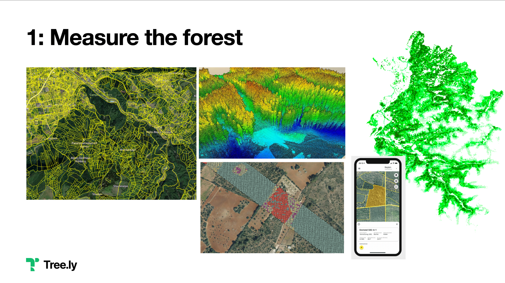
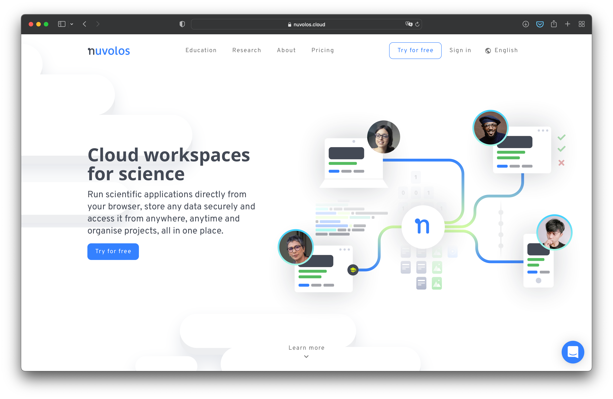
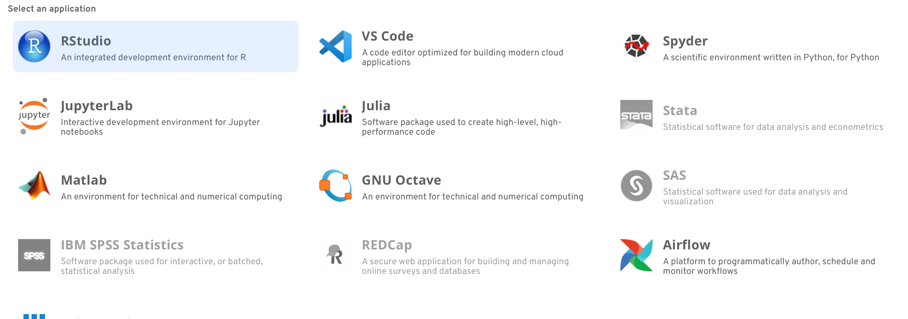

*TLDR;:* I’m member of the board of directors of [Alphacruncher](https://alphacruncher.com), the EdTech startup building [nuvolos.cloud](https://nuvolos.cloud). We’ve [just raised CHF 1.5M](https://nuvolos.prowly.com/181398-alphacruncher-a-swiss-edtech-start-up-wins-15-million-in-seed-funding-to-roll-out-its-product-globally) to rock the EdTech space.

I’m a natural scientist by education. I do my best to operate on objective reasoning, rely on data, trust the interpretation of experts. A lot of that thinking goes back to my time at University/studying (NTB Buchs in Switzerland, University of Karlruhe in Germany, but also studies abroad, e.g. Harvard Business School).

When founding [Tree.ly](https://tree.ly), it was clear to us that datascience is going to play an important role. We started with some local [Jupyter Notebooks](https://jupyter.org) in Visual Studio Code (works actually pretty well), but quickly realized we need something where we can collaborate within the team and with others.

Analyzing Forests  
Image Credits: Tree.ly, Ocell.io, illwerkevkw, TU Vienna

We continued with tools like [Amazon SageMaker](https://aws.amazon.com/sagemaker/), [Microsoft Notebooks](https://notebooks.azure.com), but also [Google Colaboratory](https://colab.research.google.com). Not to forget to run [JupyterHub](https://jupyterhub.readthedocs.io/) within our Kubernetes infrastructure. It’s amazing to see how easy everybody can do Data Science nowadays! I strongly encourage to check out these tools.

---

Only until my friend [Oliver from Zeughaus](https://www.zeughaus.com/team/oliver-ruhm/) connected me with Alexandru Popescu from [Alphacruncher](https://alphacruncher.com) and I learnt about [Nuvolos Cloud](https://nuvolos.cloud).

It’s primarly targeted to educational customers (that’s also where it is coming from), but I also see a great potential for “commercial” datascience. What do I find especially cool?

## Snapshot and shared workspaces.

Inside the platform one can easily snapshot and share datasets with others. E.g. a teacher can create an environment for an exercise and share that very environment with the entire class – and each student can continue in her/his personal environment. Only to hand in the solved problem to the teacher afterwards.

Or assume that you wrote a scientific paper, who’s findings are based on a larger dataset and a couple of computations. You cannot only share the PDF, but also provide the possibility to access the full environment and validate the findings – or even build upon them. Magic!

In our case we’re using larger datasets (e.g. a few TB of airborne laserscanning pixel clouds, parcel data and all kind of other readings) that we collaboratively work on. We can use a shared Kernel image with all dependencies installed and work on the same shared data folders – while still preserving our personal preferences and spaces.

## Resource efficiency / Shared resources

Data science has the characteristic that you need quite some resources for a rather short amount of time – and then for a larger amount of time you don’t need the instances running. Nuvolos and it’s billing/usage model makes that cloud-elasticity super simple for the user. One can book a base level of resources (that are only spun up when needed, and automatically terminated afterwards), but also book spike resources.

That’s not only convenient for companies, but even more for universities or school classes that need these resources for every student.

## Everything in the Cloud

We spoke mainly about Jupyter Notebooks, but the Nuvolos environment also provides access to Snowflake (One of the coolest databases on earth) and many other Tools. In the Cloud. In the browser. In a shared space. The team is working on expanding that toolsuite permanently. Right now it’s RStudio, VS Code, Spyder, JupyterLab, Julia, Stata, Matlab, GNU Octave, SAS, IBM SPSS, REDCap, Airflow and others.

## A winning team

During due diligence I took a look at the tech stack and got personally known to some of the core team members. They are not only using state-of-the-art technology and methodology, but also managed to attract top talent to build and operate the product.

*I couldn’t be more excited to play a small road on Alexandru’s and his team journey. Thanks for letting me ride with you.*
