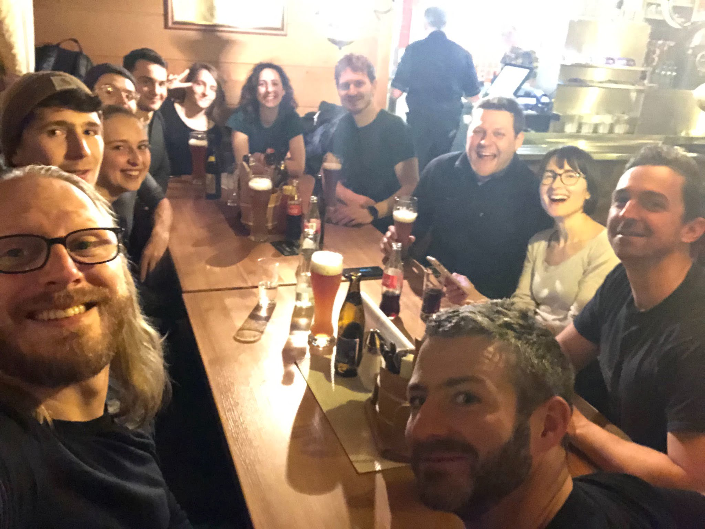

Die [“Scheitern” Ausgabe des Neue Narrative Magazin](https://www.neuenarrative.de/ausgabe-17-fehler-und-scheitern/) startet mit den “CVs des Scheiterns” der Autor:innen. Dabei berichten [Sebastian Klein](https://www.linkedin.com/in/sebxklein/), [Laura Erler](https://www.linkedin.com/in/laura-erler-5a2b50b3/), [Paul Fenski](https://www.linkedin.com/in/paul-fenski-520877158/), [Emma Marx](https://www.linkedin.com/in/emma-marx-583743148/), [Taraneh Taheri](https://www.linkedin.com/in/taraneh-taheri-408a481b3/) und [Dominik Wagner](https://www.linkedin.com/in/dominik-wagner-84305395/) steckbriefartig über “Erfolglose Bewerbungen”, “Abbrüche & Kündigungen”, “Lücken”, “Fähigkeiten, die ich nicht habe” sowie “Sonstige Niederlagen”.

Ich hatte nach den ersten 7 Seiten Tränen der “Berührung” in den Augen. #connectedness sozusagen. **Warum?**

Als Unternehmer führe ich seit vielen Jahren (immer schon?) selbstorganisierten Teams. (Manche mögen “Führung” und “Selbstorganisation” als Widerspruch sehen – NEIN! – Aber das ist ein anderes Thema). Dabei habe ich Lauf der Zeit zum Einen tiefe Einblicke in das Leben vieler Menschen bekommen – und zum Anderen viel Kritik und Gegendruck von Investor:innen, Aufsichtsräten und Kollegen für meine Einstellung bekommen.

Beim Lesen dieser Scheitern-CVs wird das Bild der Menschen kompletter und die Trust vs. Performance Betrachtung wird kompletter. Was hat das mit Trust vs. Performance auf sich?

Simon Sinek hat da meine Philosophie auf den Punkt gebracht und beschreibt "Vertrauen" im Gegensatz zu "Fachlichem Können" als die wichtigste Zutat für den Erfolg von Organisationen. Er sagt, dass Vertrauen die Grundlage für Zusammenarbeit, Innovation und letztendlich Erfolg ist. Ohne Vertrauen können Teams nicht effektiv zusammenarbeiten, und ohne Zusammenarbeit können Unternehmen nicht erfolgreich sein:

https://www.youtube.com/embed/kJdXjtSnZTI

Ich fühle mich durch die Offenheit der CVs of Failure total in diesem Ansatz bestätigt. Und Failure – und Erfolg – das ist für viele nicht vereinbar bzw. ein Widerspruch. Aber darüber zu sprechen und das passieren zu lassen – Das ist für mich ein wesentlicher Anteil für das System “New Work”. Und es braucht noch viel mehr Unternehmer:innen die dafür einstehen und das auch offen sagen.

**Failure** – vor ca. 2,5 Jahren habe ich “mein” über 7 Jahre aufgebautes System – die Firma Crate.io verlassen und habe seither von aussen mitangesehen, wie es top-down in die komplett andere Richtung umgebaut wurde. Ich sage bewusst anders und nicht falsch. Unterschiedliche (Werte)-Vorstellungen mit dem Vorsitzenden des Aufsichtsrats waren damals der wesentliche Punkt für meinen Ausstieg. Denn ich sah mich nicht mehr in der Lage, mit dem neuen Leadership die Organisation weiterzuentwickeln und dahinterzustehen.

Ich wollte beweisen, dass ein fast-growth Deep-Tech Startup mit einem “Trust” Wertesystem und “New Work” Fehlerkultur kombinierbar ist.

2,5 Jahre später sind in der Organisation noch 3 von 65 Mitarbeiter:innen meines “Trusts” verblieben, davon niemand in einer Führungsposition. Der “Werte-Exorzismus” hat viele Menschen vertrieben und neue Werte haben andere Menschen angezogen. Das hat sehr viel Leid beschert und sehr viel Geld gekostet. Der Erfolgsbeweis ist bisher ausgeblieben.

Ist das mein Failure? Einen Elefanten geholt zu haben, diesen durch “meinen” Porzellanladen ziehen gelassen zu haben?

NEIN. Es ist lediglich eine Niederlage.

---

# Mein CV of failures

## Erfolglose Bewerbungen

Ich habe mich als CTO beim Digital-Spinoff (“new mobility”) eines führenden Automobilherstellers beworben. Ich habe mir das lange überlegt und dachte, dass ich da echten Impact haben kann und geile Software auf einem breiten Scale mit viel Umweltimpact bauen kann. Und Deutschland Tesla die Stirn bieten kann. Aber ich wurde nichtmal für ein Interview eingeladen. Das hat mich in meiner Selbstsicherheit etwas geknickt 🙂

Von den 2-3 Situationen in meinem Leben wo ich mich für eine Stelle beworben habe (ehrlich gesagt waren das nur Ferialjobs) war das die einzige Bewerbung in meinem Leben die nicht geklappt hat. Ansonsten war ich immer selbständig.

## Abbrüche und Kündigungen

Siehe Text oben. Das war definitiv bitter, 7 Jahre Herzblut zu investieren, also quasi ein Viertel meines Arbeitslebens. Und dann die Kontrolle zu verlieren und gegenseitig zu kündigen.

Ein weiterer Abbruch – weiter zurückliegend – war meine Promotion. Ich hätte noch ca. 6 Monate durchhalten müssen und die finale Defensio vorbereiten und halten müssen, aber habs hingeschmissen. Das bereue ich manchmal ein bisschen. Aber eigentlich nur in Momenten wo ich etwas prahlen möchte :).

## Lücken

Während dem Studium bin ichs verhältnismässig locker angegangen. Meine Frau war um 8:00 im Büro und hat das Geld verdient, ich habe ausgiebig geschlafen und auch zwischendurch mal nach der Prüfung Faxe-Dosen am Vormittag im Park gezischt.

Auch im Jahr nach meinem Crate-Ausstieg hab ich Zeit zur Verarbeitung gebraucht, mir Zeit zur Vorbereitung der Zukunft genommen, und von Ersparnissen und Arbeitslosengeld gelebt.

## Fähigkeiten die ich nicht habe

**Geduld:** Ich glaube, dass ich recht geduldig bin. Bin ich aber nicht. Sagt mir auch mein Umfeld. Klassischer Fail von Selbstwahrnehmung und Fremdwahrnehmung. Häng aber auch davon ab, wie ausgeglichen ich bin. #sport #meditation

**Anpassungsfähigkeit:** Würde an der einen oder anderen Stelle für weniger Reibung sorgen. Ich bin aber auch (noch) nicht bereit, das loszulassen. Weil ich glaube, das brauchts auch manchmal als Unternehmer. Wobei ich “eigentlich” selber weiss, dass das Geheimnis die richtige Balance wäre. #zen

**Strukturiertheit:** Ich brauche wenig Struktur und kann gut komplexe Dinge in meinem Kopf zusammenhalten. Im zusammenleben/arbeiten mit Anderen, wäre das jedoch manchmal für meine Mitmenschen angenehmer, wenn sie mehr Struktur an der Schnittstelle hätten.

## Sonstige Niederlagen

Eine erwähnenswerte sonstige Niederlage ist vor ca. 15 Jahren passiert. Ich habe – u.A. durch nicht-funktionaler Verhaltensweise, Ego, Sturheit meinerseits – große Zukunftspotentiale meiner damaligen Firma nicht genutzt, bzw. diese weggeschmissen. Da muss ich immer wieder aufpassen, dass ich nicht “aus Prinzip” handle und die richtige Balance zwischen “Business machen” und “Recht haben” wähle.

---

Was meint ihr dazu? Ich freue mich über eine Diskussion auf [dem Linkedin-Post](https://www.linkedin.com/pulse/cv-failures-jodok-batlogg)!
