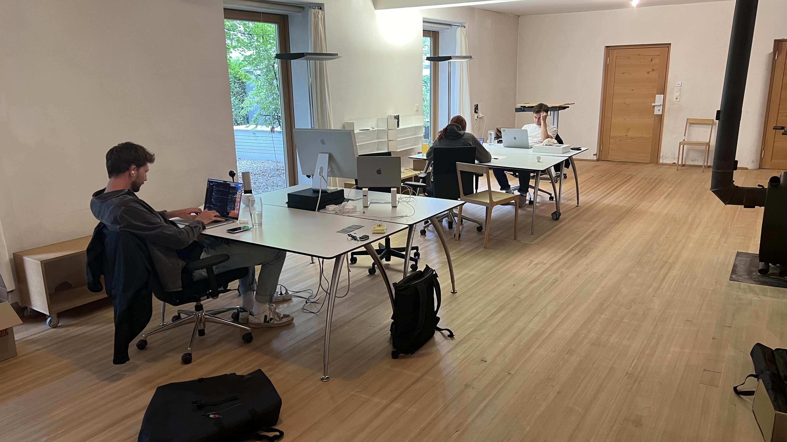
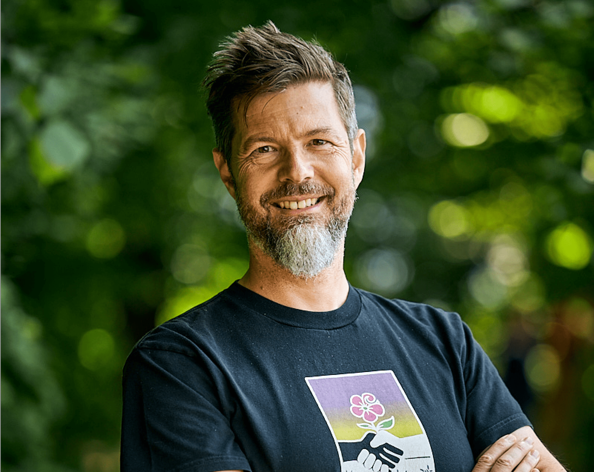
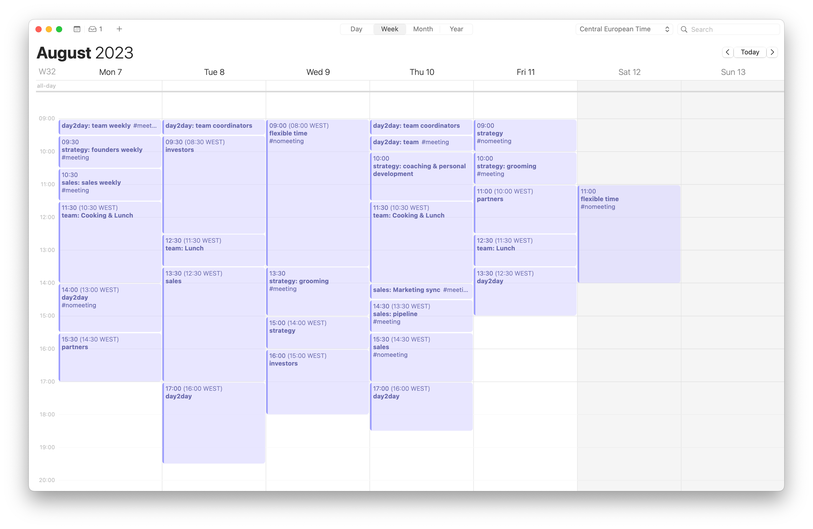
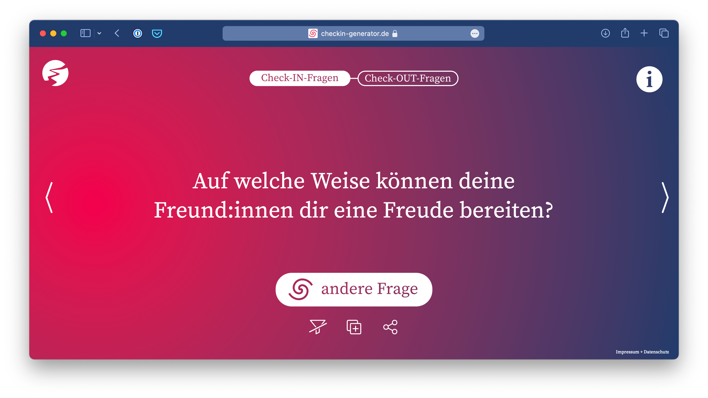
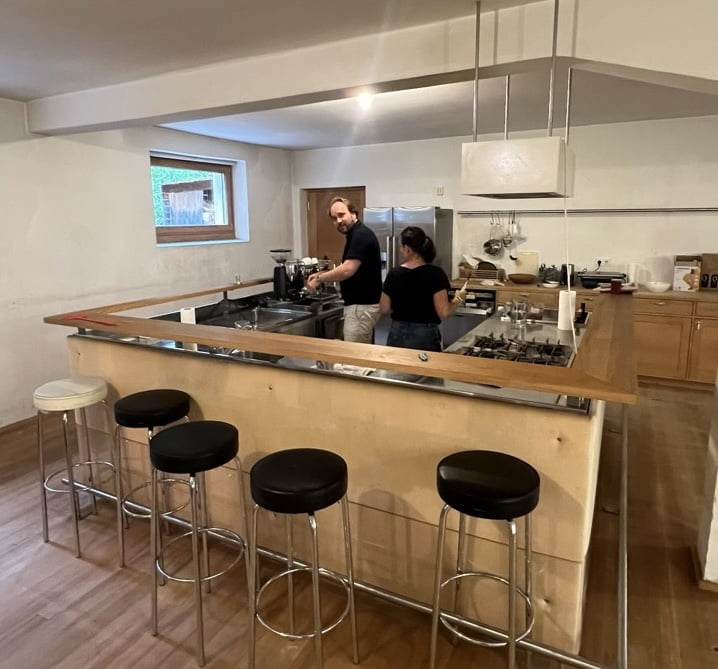
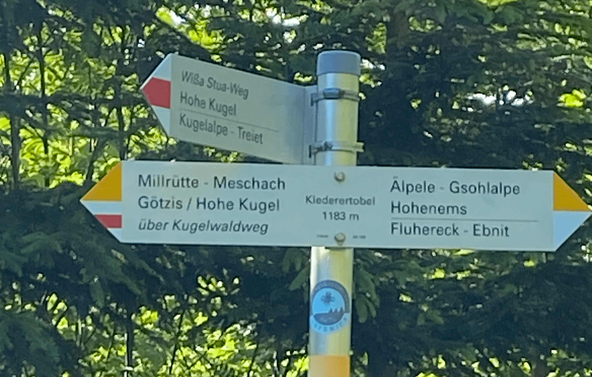
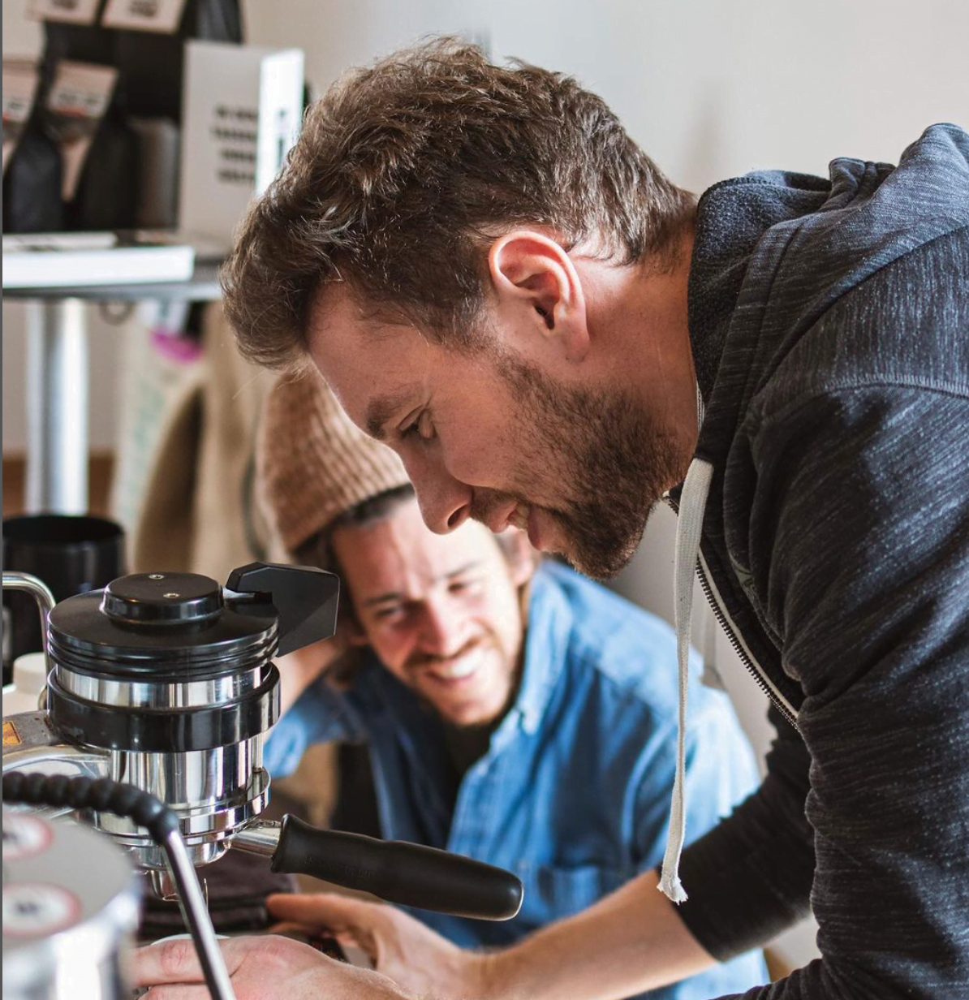
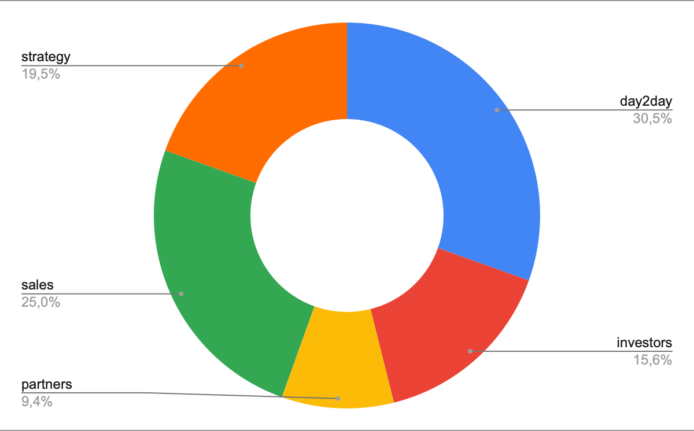

Luckily [Tree.ly](https://tree.ly/) is humming, buzzing, taking off. That feels really good. The entire team and me are putting in a lot of love, passion and effort. After two years we closed the first loop of projects certified, sold first credits, but also brought new investors on board and also just moved to a **new office**.

Tree.ly at Rossstall (we have space for co-workers)

Humming, buzzing and taking off also means **a lot operational tasks** and often being driven by urgent things. As we speak I’m using my Saturday morning to work on 185 E-Mails that require my attention, as I took a day off yesterday I have unread notifications and overdue reminders in Slack, a flow of notifications in Trello and more open tasks in Hubspot.

Still I have the feeling for the need to spend more time on important longer term items (pointer to the [Eisenhower matrix](https://www.eisenhower.me/eisenhower-matrix/) in case you haven’t heard about it).

So three weeks ago I decided to work from Lisbon for ~5-6 weeks to work more on strategy, but also **#recalibrate myself** (and not to forget improve my kitesurf skills)

* * *

This boi is setting a new habit and promising to keep his schedule

Starting monday I’m setting a new habit and time schedule. Will stick exactly to it for at least for 1 month and then do a retrospective and potentially adapt.

These are the buckets and allocations I came up with initially:

*   **Day-to-day operations**: _30%_  
    jumping in where needed and directly supporting the team, e.g. product development, customer service, marketing
*   **Sales:** _25%_  
    Directly sell to customers, marketing, PR, networking
*   **Strategy**: _20%_  
    Market research, competitive analysis, setting goals, planning
*   **Investors:** _15%_  
    work on pitch deck, meetings with impact investors, strengthen relationships with existing investors and angels.
*   **Partners & Network:** _10%_  
    Identifying, winning and enable strategic partners, networking, working with influencers, advisors

I’m running a Trello board for each of these categories, where I prioritize and organize them within their own “timebox”.

As for many of us, freedom to work when, where and how I work is important to me. Still I’m a teamplayer. So how do I allocate timeslots that allow focus time, collaboration with others, but also freedom to work out (skitour, hike) if weather is good?

Here’s my first shot! Would love to hear your feedback and experience.

* * *

My new work week

Monday
------

**9:00-9:25, #day2day, #meeting: team weekly**  
we’re a remote-first, distributed team and start into the week with a all-hands team meeting. good mood to start the week with. or a coffee together. We do a team-checkin, Christian, my co-founder and COO and me update on recent developments, set priorities and answer questions the team might have. We close with an checkout.

I highly recommend the [checkin generator](http://www.checkin-generator.de/).

**9:30-10:20, #strategy, #meeting: founders weekly**  
We discuss strategic priorities, important decision-making, and aligning on the most critical tasks to focus on for the upcoming week. Even though these tasks are often operational, the process of deciding what is most important typically requires a strategic perspective.

**10:30-11:30, #strategy, #meeting, #monthly: finance**  
This meeting only happens monthly after the previous month is fully processed by our accountant. This involves reviewing our sales numbers, runway, burn rate and other finance-related topics.

**11:30-13:30, #team: cooking/lunch**  
I’m joining the kitchen team on Monday (except once a month when we do the finance monthly). Cooking and having lunch together is an important part of our company culture. Guests are welcome anytime!

The new Rossstall Co-working kitchen in action

**13:30-14:20, #sales, #meeting: sales weekly**  
The meeting is driven by my co-founder Christian. We scrub our sales pipeline(s) – forest owners, forest project development partners, carbon buyers, carbon resellers. We set priorities for the upcoming week and I identify where my help is needed.

**14:30-14:55, #sales, #nomeeting**  
Most of the times in the sales meeting things that need to be done come up. I like to get them done straight after the meeting.

**15:00-15:55, #day2day, #nomeeting**  
After quite some meetings time to get the most important day2day stuff done. No meetings, as morning was full of them. I’ll work on my own stuff.

**16:00-16:50, #partners**  
Identify and enable partners, both in the forest and carbon buyer space. But also build and strengthen industry relationships in our space. I try to keep a balance between meetings and working on my own on this topic.

Monday tends to be an exhausting day, I try to leave the office not too late.

Tuesday
-------

**9:00-9:25, #day2day, #meeting: Team coordinators**  
CxOs and Team coordinators meet twice a week. We hand over new story proposals, solve impediments and discuss team or other issues.

**9:30-12:20, #investors**  
In the early stage, a significant amount of time may be spent on fundraising. This includes preparing for pitches, meeting with potential investors, and maintaining relationships with current investors.

**12:30-13:30, #team: Lunch**

**13:30-17:00, #sales: ongoing sales & marketing activities**  
This is the slot where I’m doing active sales as founder, working with parties on both sides: forest owners and carbon buyers. I’m also active in marketing activities such as webinars or writing content.

**17:00-19:30, #day2day: scrubbing e-mail inbox and such**  
Tuesday evenings I usually work longer on mails, errands,… as my wife Manuela also has activities that evening #zumba 🕺.

Wednesday
---------

I keep every Wednesday mornings free of meetings and plan that time flexibly. Most of the time I will start the day working from Kaffewerk Handle. But sometimes I also might do a workout, go for ski/bike or take care of my bees. It’s also the day I meet with other friends/family for lunch.

Wednesday afternoon is for Scrum – review/planning/grooming. It alternates every week.

**13:30-15:00, #day2day, #meeting: scrum review and planning 1**  
**15:00-16:00, #strategy**  
Every second week we run our scrum review meeting, where all team members present what has been achieved over the past two weeks. The meeting is followed by the scrum planning 1 meeting, where the teams commit their stories for the upcoming 2 weeks.  
Afterwards I use the time to recalibrate priorities and also (re)set my goals for the upcoming 2 weeks.  
In the alternative weeks this time is used for grooming meetings – discussing stories, estimate complexity and business value,…  
But this is also one of the slots i wanted to create with the new schedule. I’ll work on longer term, important (not necessarly urgent) stuff. I might initiate calls/meetings, but don’t accept inbound ones.

**16:00-18:00, #investors**  
Same as Monday.

Wednesday evening 19:00 is also the day and time of the week I go for a hike with my friends:

Every Wednesday: The “legendary” hiking group with my friends Stefan, Alexander, Manfred, Christoph, Wolfgang, Jump, Jörg and others.

Thursday
--------

**9:00-9:50, #day2day, #meeting: Team coordinators and Team**  
Like Tuesday morning I start with the Team coordinators sync. Afterwards I’m available for short follow-up day2day meetings with team members.

**10:00-11:30 #strategy: Coaching, personal development**  
This is the slot where I work with my coaches (or on my own).

**11:30-14:00, #team: Cooking and Lunch**  
With our new office and kitchen I want to be part of the cooking team a second time per week. Thursday I’m also going to stay longer in the office (with an afterwork beer afterwards), so an extended break over lunch is definitely beneficial for productivity.

**13:30-13:55, #sales, #nomeeting: prepare meeting**  
**14:00-14:50, #sales, #meeting: pipeline scrubbing**  
**15:00-15:25, #sales, #meeting: weekly sales/marketing alignment**  
**15:30-16:50, #sales, #nomeeting**  
Thursday afternoon is sales focus.

**17:00-18:30, #day2day**  
This is the time where I hopefully reach Inbox Zero the second time in the week.

I like Thursdays – because most of the time I go straight from the office to an after work drink with friends.

Friday
------

**9:00-10:00, #strategy: OKR review/preparation**  
I want to review where we stand with our strategic initiatives and also identify upcoming priorities

**10:00-11:00, #day2day, #meeting: Retrospective**  
This slot will alternate with the 2-week scrum cycle. The one week we’ll hold a company-retrospective (each team is sending one representative), the other week I’ll work on partners stuff.

**11:00(10:00)-12:30, #partners**

**12:30-13:30, #team: Lunch**

**13:30-15:00, #day2day**  
Hopefully Inbox Zero by 15:00, otherwise I might stay a bit longer 🙂

Saturday
--------

I generally don’t work weekends. However it became a habit that – while Manuela is at the stable with the horse – I hang out at Kaffeewerk Handle with my computer. I do stuff I like. Playing with ChatGPT and hacking stuff, reading articles I saved during the week, writing Blogposts.

Thomas from Kaffeewerk Handle

* * *

The current stats of this schedule:

Right now 66% of the block – day2day/parts of sales/strategy are scheduled meetings. This might be a problem. But first I’m excited to see how this turns out in the first iteration.

Of course, emergencies, offsites, quarterly OKR blocks, customer visits,… might overturn this schedule now and then. But I’ll try to minimize this. At least until I learnt the new habit.

Also how it plays for the team. Apart from the meeting time allocation I also need to dig deeper into how I work/prioritize within the different categories. ChatGPT has proved helpful to put this together and will also help me getting that done.

I’ll keep you posted and would love to hear feedback! I will edit and document changes as we go.

* * *

**Updates:**

_August, 7th:_ Isa (finance) is picking up kids monday 12, so moved finance slot forward and pushed sales to afternoon. That also lead to slight reshuffling of the day2day meeting.

_August, 7th:_ swapped sales meeting from a.m. to p.m. on Thursdays, so one less context switch.